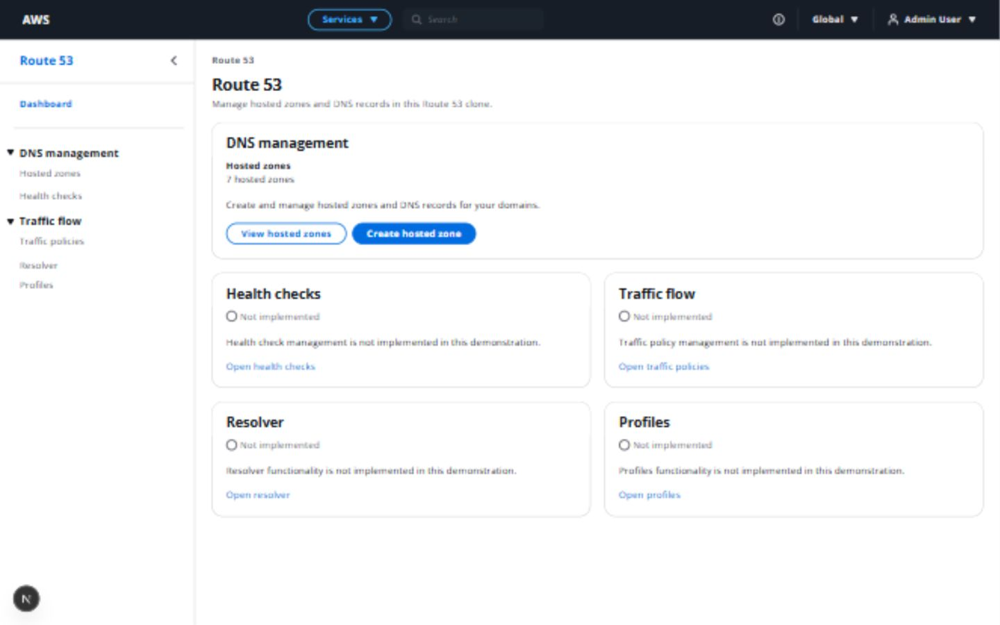
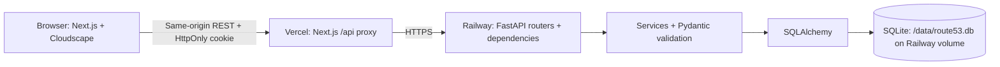
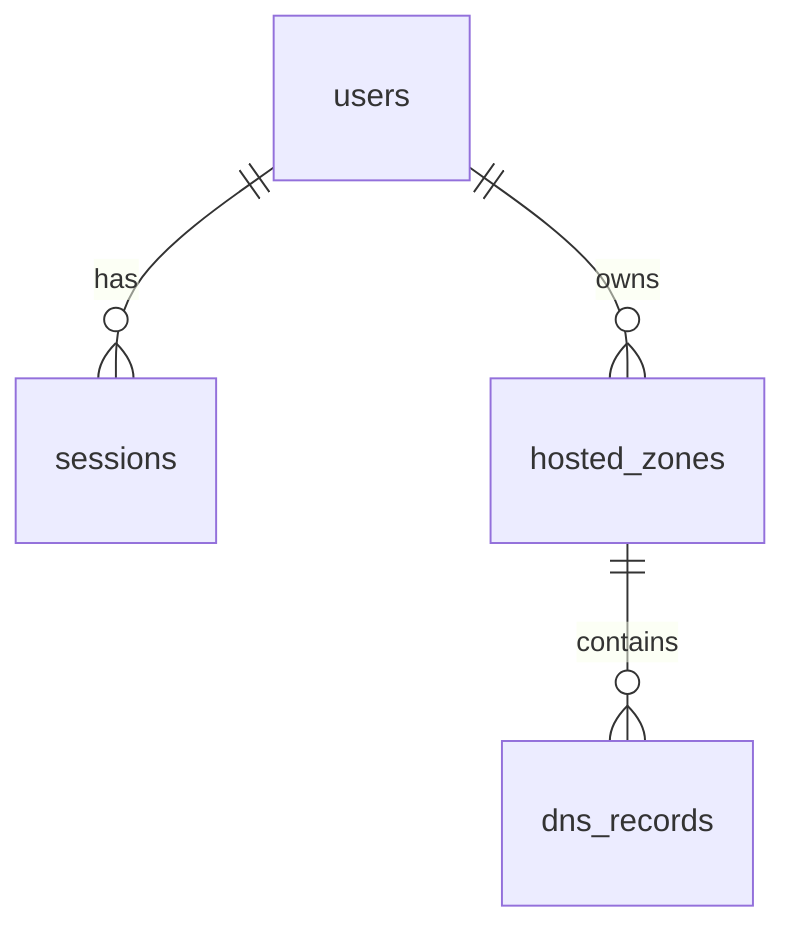

# AWS Route 53 Clone

A full-stack recreation of core AWS Route 53 console workflows, built with Next.js, TypeScript, Cloudscape, FastAPI, SQLAlchemy, and SQLite.

This application recreates the Route 53 user experience and resource-management workflows. **It does not provide real DNS hosting or DNS resolution**, provision AWS resources, or require AWS credentials. It is not affiliated with AWS.

## Live Demo

**[Open the Route 53 console](https://aws-route53-clone-ecru.vercel.app)** — the single public entry point for evaluators.

Sign in with **`admin@route53.local` / `admin123`**. These are intentionally public demonstration credentials. The demo account is shared; use disposable resource names and remove your test resources when finished.

The frontend runs on Vercel and sends same-origin `/api/*` requests through a server-side proxy to Railway. Hosted zones, records, and sessions persist in SQLite on an attached Railway volume. Public authentication, resource CRUD, and persistence after an actual Railway restart were verified on October 9, 2026; see the [deployment verification report](docs/task16-public-verification.md).

## Features

- **Authentication:** demo sign-in, persistent HttpOnly sessions, session checking, protected routes, and sign-out.
- **Hosted zones:** public/private CRUD, search, type filtering, sorting, pagination, AWS-style IDs, detail pages, and automatic mock NS/SOA records.
- **DNS records:** CRUD, multiple values, search, type filtering, sorting, pagination, and protected system records. User types: **A, AAAA, CNAME, TXT, MX, NS, PTR, SRV, CAA**. SOA is system-generated only.
- **Console:** dashboard with a real owner-scoped hosted-zone total, functional resource links, shared navigation and breadcrumbs, validation feedback, confirmation modals, and Flashbar success notifications.
- **Intentionally unavailable sections:** Health checks, Traffic policies, Resolver, and Profiles have complete navigation and explanatory pages, as permitted by the assignment.

## Screenshots

These are actual application captures. Their resource data illustrates workflows; a fresh installation starts with no hosted zones.

| Page | Screenshot |
| --- | --- |
| Sign in | [View](docs/images/task13-login-1440.jpg) |
| Hosted zones | [View](docs/images/task13-zones-1440.jpg) |
| Create hosted zone | [View](docs/images/task13-zone-create-1440.jpg) |
| Hosted zone and records | [View](docs/images/task13-zone-detail-1440.jpg) |
| Create DNS record | [View](docs/images/task12-create-1440.jpg) |



## Tech Stack

| Area | Implementation |
| --- | --- |
| Frontend | Next.js 16 App Router, React 19, strict TypeScript, Cloudscape Design System |
| HTTP | One configured, credentialed native-fetch client |
| Backend | FastAPI, Pydantic, Uvicorn, SQLAlchemy 2 |
| Persistence | SQLite, Alembic migrations |
| Authentication | pwdlib/Argon2id passwords, random opaque sessions with SHA-256 token hashes |
| Quality | ESLint, TypeScript, Node's test runner, pytest, HTTPX |

Dependency versions are pinned in `frontend/package.json`, `frontend/package-lock.json`, and `backend/requirements*.txt`.

## Local Development Setup

Prerequisites: **Node.js 20.9+**, npm, **Python 3.11+**, and pip. Verification used Node 24.19.0, npm 11.17.0, and Python 3.11.9 on Windows. Keep both services running in separate terminals. Use `localhost` consistently for frontend and API URLs; cookies are host-specific.

### 1. Backend

From the repository root, Windows PowerShell (activation is not required):

```powershell
cd backend
Copy-Item .env.example .env
python -m venv .venv
.\.venv\Scripts\python.exe -m pip install -r requirements.txt
.\.venv\Scripts\python.exe -m alembic upgrade head
.\.venv\Scripts\python.exe -m app.scripts.seed_demo_user
.\.venv\Scripts\python.exe -m uvicorn app.main:app --reload
```

macOS/Linux:

```bash
cd backend
cp .env.example .env
python3 -m venv .venv
source .venv/bin/activate
python -m pip install -r requirements.txt
python -m alembic upgrade head
python -m app.scripts.seed_demo_user
python -m uvicorn app.main:app --reload
```

The migration command creates or updates the database. Relative SQLite paths resolve under `backend/`, independent of the launch directory. Direct local Uvicorn startup does not create tables, migrate, seed, or backfill historical records. The separate production startup script validates configuration and storage, then runs migrations and seeding before starting Uvicorn.

Seeding creates the configured demo user once. Running it again does **not** reset an existing password, display name, or inactive status. The seed creates no hosted zones.

| Local endpoint | Purpose |
| --- | --- |
| [API root](http://localhost:8000/) | Configured application name |
| [Health](http://localhost:8000/health) | Liveness only; not a database readiness check |
| [Swagger UI](http://localhost:8000/docs) | Interactive API documentation |
| [ReDoc](http://localhost:8000/redoc) | Readable API reference |
| [OpenAPI](http://localhost:8000/openapi.json) | Machine-readable contracts |

### 2. Frontend

In a second terminal, from the repository root:

```powershell
cd frontend
Copy-Item .env.example .env.local
npm ci
npm run dev
```

macOS/Linux:

```bash
cd frontend
cp .env.example .env.local
npm ci
npm run dev
```

Open [http://localhost:3000](http://localhost:3000). `/` resolves the backend session and redirects to `/login` or `/route53`. The frontend depends on the running API for authentication and resources.

**Demo credentials:** `admin@route53.local` / `admin123` (display name: `Admin User`). These are deliberately public demonstration credentials, configurable before the first seed.

If sign-in cannot reach the API, check its startup, the API base URL, and the configured frontend origin. An empty resource list on a fresh install is expected. Restart the frontend after changing its environment configuration.

## Environment Variables

Copy [backend/.env.example](backend/.env.example) and [frontend/.env.example](frontend/.env.example) as shown above. Environment variables override the backend `.env`; defaults also allow local startup. Do not commit local environment files or database files.

| Backend variable | Default/example | Purpose |
| --- | --- | --- |
| `APP_NAME` | `Route53 Clone API` | API title and root response |
| `APP_ENV` | `development` | Environment label; influences the default Secure cookie flag |
| `DATABASE_URL` | `sqlite:///./route53.db` | Database location |
| `FRONTEND_ORIGIN` | `http://localhost:3000` | One explicit credentialed CORS origin; scheme/host/port only |
| `DEMO_USER_EMAIL` | `admin@route53.local` | Identity created by the seed command |
| `DEMO_USER_PASSWORD` | `admin123` | Password hashed during first seed |
| `DEMO_USER_DISPLAY_NAME` | `Admin User` | Initial account display name |
| `SESSION_COOKIE_NAME` | `route53_session` | Session cookie name |
| `SESSION_TTL_HOURS` | `24` | Session and cookie lifetime |
| `SESSION_COOKIE_SECURE` | `false` in the example | Local HTTP setting; enable with HTTPS. If omitted, defaults to true for `APP_ENV=production` |
| `SQLITE_VOLUME_PATH` | `/data` in production | Required mounted persistent volume for the production startup script |
| `PORT` | Provider-supplied in production | Production listener port; Railway supplies `8080` for this deployment |

| Frontend variable | Default/example | Purpose |
| --- | --- | --- |
| `NEXT_PUBLIC_API_BASE_URL` | `http://localhost:8000` locally; unset/empty in production | Public API base URL; production defaults to same-origin `/api/*`. Never place secrets here |
| `API_PROXY_TARGET` | Railway HTTPS backend origin | Server-only, build-time destination for the production `/api/*` rewrite; rebuild after changing it |

## Architecture



Frontend routes compose feature components. A root authentication provider resolves `/api/auth/me`; a guard keeps protected content hidden until authentication succeeds. Forms share create/edit implementations and keep input on API failure. Cancellable hooks suppress obsolete responses, and tables retain search/filter/sort/page state locally. Search is debounced for 350 ms. Auth and console notifications are shared; the small hosted-zone context supplies breadcrumb names and is not a resource cache.

Backend routers handle HTTP inputs, dependencies, status codes, and response models. Services own queries, ownership checks, normalization, and write transactions. One engine, session factory, declarative base, and request-scoped session dependency support the application. Failed write transactions roll back; request sessions always close. Production startup runs Alembic and the idempotent demo seed before launching one Uvicorn worker. Local development can call FastAPI directly using the explicit localhost API base.

The production browser receives a host-only, Secure, HttpOnly, SameSite=Lax session cookie through the Vercel proxy. Authentication tokens are not returned in JSON or stored in browser JavaScript storage. Railway retains an exact HTTPS frontend origin for credentialed CORS and trusted-Origin write protection.

### Repository Structure

```text
frontend/
  app/                         App Router pages and layouts
  components/
    auth/                      Session provider, guards, sign-in, status
    layout/                    AWS-style shell, navigation, breadcrumbs
    dashboard/                 Owner-scoped hosted-zone summary
    common/                    Shared unavailable-service pages
    hosted-zones/              Table, shared form, details, delete modal
    dns-records/               Table, shared form, values, delete modal
    notifications/             Shared Flashbar state
  hooks/                       Auth access and cancellable resource fetching
  lib/api/                     Credentialed client, feature APIs, error feedback
  lib/auth/                    Safe internal sign-in destinations
  lib/constants/               Navigation and supported regions
  lib/hosted-zones/             Hosted-zone form normalization/validation
  lib/validation/              DNS form rules
  types/                       API/domain contracts
  tests/                       Node helper tests; existing TypeScript compiler
backend/
  app/
    core/                      Configuration, security, email validation
    db/                        Engine, sessions, Base, UTC types
    dependencies/              Authentication, ownership context, DB sessions
    routers/                   Service, auth, hosted-zone, record HTTP routes
    services/                  Auth, CRUD, system records, DNS normalization
    models/                    Four SQLAlchemy models and enums
    schemas/                   Pydantic request/response contracts
    scripts/                   Production startup and idempotent demo-user seed
  alembic/versions/             Two incremental schema migrations
  tests/                       Isolated database and API regression tests
  requirements*.txt            Runtime and development dependencies
  README.md                    Backend quick reference
docs/                          Screenshots and verification evidence
README.md                      Setup and final project reference
```

## Database Schema



| Table | Meaningful fields |
| --- | --- |
| `users` | `id` integer PK, unique `email`, `display_name`, `password_hash`, `is_active`, `created_at`, `updated_at` |
| `sessions` | `id` UUID PK, `user_id` FK, unique `token_hash`, `expires_at`, `created_at`, nullable `last_seen_at` |
| `hosted_zones` | `id` AWS-style string PK, `owner_id` FK, `name`, nullable `comment`, `zone_type`, nullable `vpc_id`/`region`, `created_at`, `updated_at` |
| `dns_records` | `id` UUID PK, `hosted_zone_id` FK, `name`, `record_type`, JSON-list `values`, nullable `ttl`, `routing_policy`, `alias`, nullable JSON `alias_target`, `is_system`, `created_at`, `updated_at` |

- SQLite foreign keys are enabled on every application connection. Database `ON DELETE CASCADE` and ORM delete-orphan cascades remove a zone's records and a user's zones/sessions. There is no user-deletion UI/API.
- Indexes cover email, session hash/user/expiry, zone owner/name, and record zone/name/type. The unique composite index `(hosted_zone_id, name, record_type)` enforces one Simple record set per name/type.
- Hosted-zone names are intentionally **nonunique**, including for the same owner. Each zone has independent IDs and records.
- `record_count` is a response-only derived SQL aggregate, never a mutable column. Lists filter, sort, count, and paginate in SQL rather than loading all rows.
- Database checks enforce enum/boolean values, private-zone metadata, positive nonnull TTLs, and JSON-array record values. Pydantic provides the stronger request validation.
- Python timestamps are timezone-aware UTC; SQLite stores UTC without a timezone and the application restores UTC on read.
- Migration chain: `0001_core_tables` → `0002_record_set_uniqueness`. Historical duplicate record sets cause migration failure rather than silent deletion. Fresh migration/model parity is tested.

## API Overview

All resource routes require a valid session. Missing, cross-owner, and cross-zone resources return **404**; unauthenticated access returns **401**. Invalid input returns sanitized **422** feedback, and duplicate/protected record changes return **409**. POST creates return **201**; DELETE returns **204**. Browser writes reject untrusted Origin headers.

| Area | Methods and paths |
| --- | --- |
| Authentication | `POST /api/auth/login`, `GET /api/auth/me`, `POST /api/auth/logout` |
| Hosted zones | `GET /api/hosted-zones`, `POST /api/hosted-zones` |
| Hosted-zone resource | `GET`, `PATCH`, `DELETE /api/hosted-zones/{zone_id}` |
| Records | `GET`, `POST /api/hosted-zones/{zone_id}/records` |
| Record resource | `GET`, `PATCH`, `DELETE /api/hosted-zones/{zone_id}/records/{record_id}` |

Both list responses have `items`, `page`, `page_size`, `total`, and `pages`. Common query defaults: `page=1`, `page_size=20` (1–100), `sort_by=name`, `sort_order=asc` (`asc`/`desc`). Unknown query fields are rejected. Sorting uses a whitelist and stable tie breakers.

| Collection | Additional query parameters |
| --- | --- |
| Hosted zones | `search`: literal substring of name/comment/ID, max 253; `zone_type`: `PUBLIC`/`PRIVATE`; `sort_by`: `name`, `zone_type`, `created_at`, `updated_at`, `id` |
| Records | `search`: literal substring of name or serialized JSON values, max 4096; `record_type`: any stored type including SOA; `system`: optional boolean; `sort_by`: `name`, `record_type`, `ttl`, `created_at`, `updated_at` |

Search is trimmed, ASCII case-insensitive, parameter-bound, and treats SQL LIKE wildcards literally. PATCH merges supplied writable fields with existing state and validates the complete result; empty patches are rejected. IDs, ownership, timestamps, and `is_system` are not writable.

In [Swagger](http://localhost:8000/docs), execute `POST /api/auth/login` with the demo credentials first. Subsequent same-origin requests carry the cookie automatically; the Authorize input cannot establish an HttpOnly cookie. The configured `SessionCookie` scheme documents the resource authentication contract.

## Authentication and Security

```text
Sign in → Argon2id password verification → random 256-bit session token
        → SHA-256 token hash in SQLite + raw token in HttpOnly cookie
        → /api/auth/me resolves the current user
```

There is no JWT or browser token storage. Cookies use `HttpOnly`, `SameSite=Lax`, a bounded lifetime, and a configurable `Secure` flag. Sessions expire server-side; logout removes the session and clears the cookie. Login rotates the current browser session; inactive users cannot authenticate. `/me` records `last_seen_at`. Passwords and session hashes never appear in public API responses; validation errors do not echo submitted credentials.

Every resource operation checks ownership, and system-record protection is enforced in the API as well as the UI. CORS allows one configured frontend origin with credentials; write-origin checking complements the cookie policy. This demonstration is **not production-hardened**: it has public demo credentials and no IAM, MFA, password recovery, or login rate limiting.

Dependency audit on 2026-10-09: `npm audit --omit=dev` reported zero findings. Full `npm audit` reported five high-severity entries in the ESLint → fast-glob → micromatch → braces development chain, caused by [GHSA-vfj7-8cjw-p6xm](https://github.com/advisories/GHSA-vfj7-8cjw-p6xm). No patched braces release was available; the suggested Next ESLint downgrade was not applied. Review upstream fixes before using untrusted glob patterns in development tooling.

## Hosted Zones and DNS Validation

Creating either zone type atomically stores the zone and two system record sets. Zone IDs use `Z` plus 20 random uppercase alphanumerics; record IDs are UUID4.

- **NS:** four unique mock AWS-style nameservers, trailing-dot targets, TTL 172800.
- **SOA:** first NS, `awsdns-hostmaster.amazon.com.`, then `1 7200 900 1209600 86400`; record TTL 900.
- Both have `is_system=true` and are readable but individually immutable. Ordinary delegated NS records remain editable.
- Zone rename updates only system NS/SOA owner names, retaining IDs/values/TTLs. It does **not** rename user records. Historical zones predating system-record creation are not automatically backfilled.

Zone names normalize whitespace/case and one trailing dot, with ASCII labels of 1–63 characters and at most 253 characters overall. Protocols, internal spaces, wildcard zone names, underscores, and Unicode domains are rejected; single-label zones are supported. Comments are nullable and at most 1024 characters. Private zones require a supported region and `vpc-` plus 8–17 lowercase hexadecimal characters; no AWS existence lookup occurs. Switching to public clears private metadata.

Record names accept a relative single label, an in-zone FQDN, blank/`@` for apex, and `_service._protocol` prefixes for SRV. Stored owner names are lowercase without a trailing dot; hostname targets gain one trailing dot. Wildcards and TXT/SRV underscore labels follow the implemented validation rules.

| Type | Value validation |
| --- | --- |
| A / AAAA | Strict IPv4 / IPv6; scoped IPv6 addresses are rejected |
| CNAME | One hostname; cannot be at the zone apex |
| TXT | Nonblank text; optional surrounding quotes removed, internal spaces retained |
| MX | Priority 0–65535 plus hostname |
| NS / PTR | Hostname targets, without URLs or IP addresses |
| SRV | Priority, weight, port 0–65535 plus hostname or `.` |
| CAA | Flags 0–255, alphanumeric tag of 1–15 characters, nonblank property value |
| SOA | Generated by the system; unavailable in user create/edit forms |

User records have TTL 1–2147483647 and 1–100 values, each at most 4096 characters. Values are normalized and deduplicated in order by the backend. Control characters/line breaks are rejected. Frontend validation catches obvious mistakes; backend validation remains authoritative. Only Simple routing is writable, and alias writes are unavailable despite reserved persistence fields.

## UI / UX and Design Decisions

Cloudscape closely follows AWS console layout and interaction patterns through TopNavigation, SideNavigation, AppLayout, breadcrumbs, dense tables, left-aligned forms, resource metadata, confirmation modals, and Flashbar notifications. Create/edit forms are reused, actions prevent duplicate submissions, and errors preserve entries. Success messages survive client navigation, can be dismissed, expire after 30 seconds, and are bounded to four visible messages.

| Frontend route | Purpose |
| --- | --- |
| `/login` | Demo sign-in outside the service shell |
| `/route53` | Dashboard; efficient hosted-zone count using `page_size=1` |
| `/route53/hosted-zones` | Hosted-zone collection |
| `/route53/hosted-zones/create` | Create zone |
| `/route53/hosted-zones/[zoneId]` | Zone metadata and records |
| `/route53/hosted-zones/[zoneId]/edit` | Edit zone; independently reloadable |
| `/route53/hosted-zones/[zoneId]/records/create` | Create record |
| `/route53/hosted-zones/[zoneId]/records/[recordId]/edit` | Edit record; independently reloadable |
| `/route53/health-checks`, `/route53/traffic-policies`, `/route53/resolver`, `/route53/profiles` | Intentionally unavailable services |

The nested record API makes parent ownership explicit. Derived counts avoid redundant state. SQLite provides local assignment persistence, while services separate HTTP handling from business rules. State stays lightweight: no Redux, Zustand, or additional toast package.

## Testing

Frontend, from `frontend/`:

```bash
npm run lint
npm run typecheck
npm test
npm run build
```

Backend, from `backend/`, Windows:

```powershell
.\.venv\Scripts\python.exe -m pip install -r requirements-dev.txt
.\.venv\Scripts\python.exe -m pytest -W error -q
.\.venv\Scripts\python.exe -m pip check
.\.venv\Scripts\python.exe -m alembic check
```

macOS/Linux, with the backend virtual environment active:

```bash
python -m pip install -r requirements-dev.txt
python -m pytest -W error -q
python -m pip check
python -m alembic check
```

Backend tests migrate isolated temporary SQLite databases, never the developer database. They cover authentication, owner isolation, CRUD, private/public transitions, all DNS types, normalization, search/filter/sort/pagination, system protection, cascades, uniqueness races, rollback, persistence, and migration/model parity. Node tests cover DNS validation, API behavior/error feedback, hosted-zone payloads, and safe authentication destinations without another testing framework.

Task 16 verification passed **398 backend tests**, **15 frontend tests**, lint, typecheck, and production build. Public browser CRUD, authentication, API documentation, cookie attributes, system-record protection, and persistence after an actual Railway restart also passed; see [public deployment verification](docs/task16-public-verification.md). Earlier clean-install, migration, and engineering-audit checks are retained in the [Task 14–15 report](docs/task14-15-verification.md). Browser testing is documented manual verification, not an automated browser test suite.

## Evaluator Walkthrough

1. Sign in with the demo credentials and open Hosted zones from the dashboard.
2. Create `example.com` as public; inspect its generated NS/SOA and record count.
3. Create a `www` A record with `192.0.2.10`; search/filter, edit, and confirm-delete it.
4. Select a system NS/SOA record and observe disabled mutation actions.
5. Edit the hosted-zone description, refresh its detail/edit URLs, and verify session persistence.
6. Create a private zone with `ap-south-1` and `vpc-0123456789abcdef`; inspect private metadata.
7. Visit the four unavailable-service pages, then sign out and verify protected navigation returns to login.

## Limitations

No real DNS resolution/delegation, AWS account/IAM integration, real VPC associations, health checks, traffic policies, Resolver, or Profiles. Only Simple routing is implemented; AWS Alias and advanced routing are unavailable. TXT handling is practical text validation rather than a BIND zone-file parser. User record names are retained when a zone is renamed and may need editing to belong to the new domain. SQLite is used for the assignment deployment with one volume-backed backend instance; horizontal scaling is not configured.

A Cloudscape development warning about its internal mobile-navigation button overriding `aria-haspopup` was observed during the earlier local audit. The public production browser checks recorded no console warnings or errors. The development dependency advisory above remains unresolved upstream.

## Future Improvements

Potential later work: BIND import/export, JSON export, bulk operations, dark mode, keyboard shortcuts, and additional routing policies. These bonuses are **not implemented**.

## Deployment

The live frontend is **[https://aws-route53-clone-ecru.vercel.app](https://aws-route53-clone-ecru.vercel.app)**. Both services use `gitHubPalak21/aws-route53-clone`.

| Service | Production configuration |
| --- | --- |
| Vercel frontend | Root directory `frontend`; Next.js production build |
| Frontend proxy | `API_PROXY_TARGET=https://aws-route53-clone-production-3fbd.up.railway.app` |
| Browser API base | `NEXT_PUBLIC_API_BASE_URL` unset/empty; same-origin `/api/*` |
| Railway backend | Root directory `/backend`; start command `python -m app.scripts.start_production` |
| Backend environment | `APP_ENV=production`, `SESSION_COOKIE_SECURE=true` |
| Trusted frontend | `FRONTEND_ORIGIN=https://aws-route53-clone-ecru.vercel.app` |
| SQLite | `DATABASE_URL=sqlite:////data/route53.db`, `SQLITE_VOLUME_PATH=/data` |
| Persistent storage | `aws-route53-clone-volume`, mounted at `/data` |
| Listener and healthcheck | `0.0.0.0:$PORT` (provider-supplied `8080`); `/health` |
| Concurrency | One Railway replica and one Uvicorn worker |

Production startup validates the HTTPS/cookie configuration and the mounted writable volume, runs `alembic upgrade head`, seeds the demo user idempotently, and starts Uvicorn. It refuses to fall back to an ephemeral SQLite database. Changing `API_PROXY_TARGET` requires a new frontend build; changing Railway variables requires applying them and restarting/redeploying the service.

Technical links: [Backend API](https://aws-route53-clone-production-3fbd.up.railway.app), [Swagger UI](https://aws-route53-clone-production-3fbd.up.railway.app/docs), [OpenAPI](https://aws-route53-clone-production-3fbd.up.railway.app/openapi.json), and [Health](https://aws-route53-clone-production-3fbd.up.railway.app/health). These support API inspection; evaluators should use the Vercel Live Demo for the application. `/health` is a liveness endpoint, not a database readiness probe.

See [Task 16 public verification](docs/task16-public-verification.md) for startup, public workflows, actual restart persistence, security checks, and test results.
