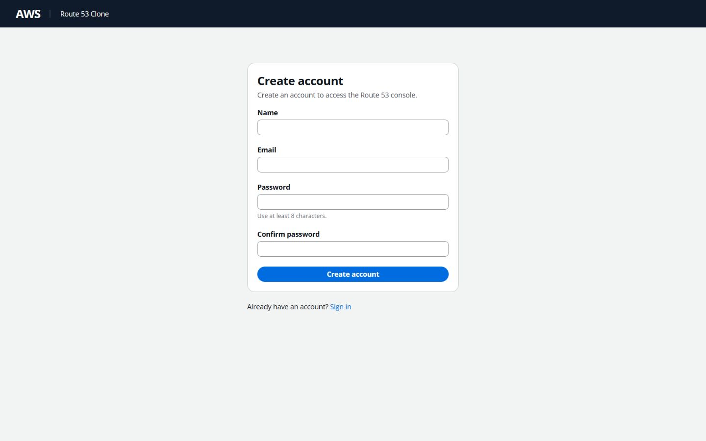
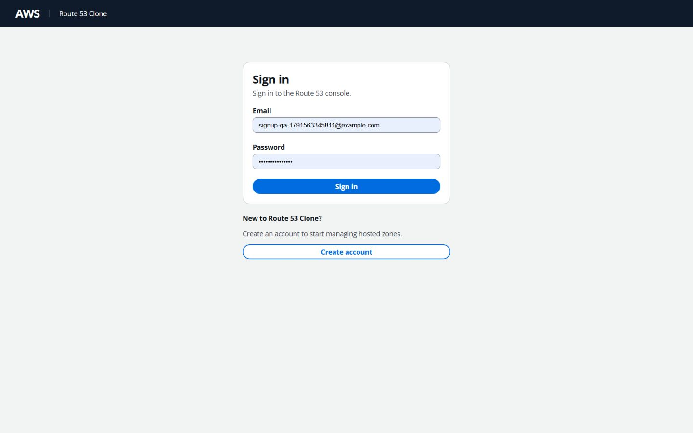

# Account registration verification

Verified on October 9, 2026 against implementation commit `90df7ec` and the existing Vercel/Railway deployments. This enhancement adds account registration only; the seeded evaluator account and resource workflows remain available.

## Implementation

- Public `POST /api/auth/register` accepts `display_name`, `email`, and `password`; returns 201 with the existing `{user: {id, email, display_name}}` response.
- Names are trimmed and limited to 128 characters. Emails use the existing format validator and are trimmed/lowercased. Passwords require 8–1024 characters and use existing Argon2id hashing.
- User and normal server-side session creation commit together. Exceptions roll back both writes and any previous-session rotation. Duplicate normalized emails return 409, including stale-precheck races caught by the database unique constraint.
- Login and registration share session generation and cookie response helpers. Cookie name, lifetime, HttpOnly, Secure production behavior, SameSite=Lax, and Path=/ are unchanged. SQLite stores only session token hashes; JSON contains neither passwords/hashes nor tokens.
- `/login` replaces the prominent demo block with a Create account link. `/signup` shares its shell, validates four labeled fields, masks passwords, clears them after submission, prevents duplicate requests, and handles sanitized validation/duplicate/general errors. Success installs the backend-returned identity in AuthProvider and redirects to `/route53` without another `/me` request.
- Authenticated signup visitors redirect to the dashboard. Refresh still recovers the server session through `/me`. No browser auth storage, dependencies, tables, or migrations were added. `alembic check` reports no new upgrade operations.

## Automated checks

| Check | Actual result |
| --- | --- |
| Backend `pytest -q -W error` | 419 passed, 0 failed, 0 skipped; 175.68 seconds |
| Frontend `npm test` | 20 passed, 0 failed, 0 skipped |
| Frontend lint | Passed, zero warnings |
| Frontend typecheck | Passed |
| Frontend production build | Passed; `/signup` is generated |
| Alembic model/migration parity | No new upgrade operations |

The 21 new backend cases cover normalization, password/session hashing, safe responses, validation, duplicate email and unique-constraint races, rollback, cookie configuration, session reconnection, logout/re-login, session rotation, trusted origin, two-owner resource isolation, and Swagger. Five new Node tests cover signup validation, password confirmation, payload normalization, credentialed registration, and safe API error handling. UI navigation/redirect checks below are manual browser checks using the existing tooling; no additional test framework was introduced.

## Browser verification

Local browser checks passed: login → Create account, required field errors, password mismatch, successful signup → dashboard, zero zones, refresh, authenticated signup redirect, and duplicate-email field/general feedback with cleared passwords. The shared Cloudscape layout was visually inspected locally and in production.

Production browser flow passed through the canonical frontend:

1. Open login and follow Create account.
2. Register a unique QA user; automatically reach the authenticated dashboard with zero hosted zones.
3. Refresh and remain signed in; the hosted-zone list shows its normal empty state.
4. Create a personal public zone and inspect generated system NS/SOA records and count 2.
5. Sign out, sign in using the new credentials, and verify the created zone remains in the personal list.
6. Visit `/signup` while authenticated and confirm the dashboard redirect.
7. Sign out and separately sign in with `admin@route53.local` / `admin123`; the admin dashboard retains its own 22-zone baseline and excludes the new user's zone.

Public browser console checks returned no warning/error entries. After logout, direct protected-route navigation redirected to sign in without displaying protected content.

## Production API checks

Requests used the Vercel same-origin proxy with separate cookie jars for the registered user and demo admin. Checks passed for `/me`, production HttpOnly/Secure/SameSite=Lax/Path cookie attributes, personal DNS-record creation, normalized duplicate registration (409), safe validation (422), and untrusted-origin rejection (403).

In both directions, cross-owner zone GET/PATCH/DELETE and record list/create/GET/PATCH/DELETE returned 404. Listings showed only owned resources. Registered-user logout revoked the session and `/me` returned 401.

The Railway `/health`, `/docs`, and OpenAPI document are live. Swagger includes register, login, me, and logout. No provider project/service, public URL, proxy target, or frontend-origin setting was changed.

Only disposable resources created for this signup check were removed after verification: the admin isolation zone, new-user A record, and browser-created new-user zone. Older admin resources were preserved. The QA account remains as a normal empty account; account deletion is outside this task.

## Public links and screenshots

- [Live console](https://aws-route53-clone-ecru.vercel.app)
- [Create account](https://aws-route53-clone-ecru.vercel.app/signup)
- [Backend](https://aws-route53-clone-production-3fbd.up.railway.app)
- [Swagger](https://aws-route53-clone-production-3fbd.up.railway.app/docs)

No known registration blockers remain. Email verification, password recovery, OAuth, IAM, roles, and profile management were deliberately not added. Existing demonstration security limitations remain documented in the main README.
