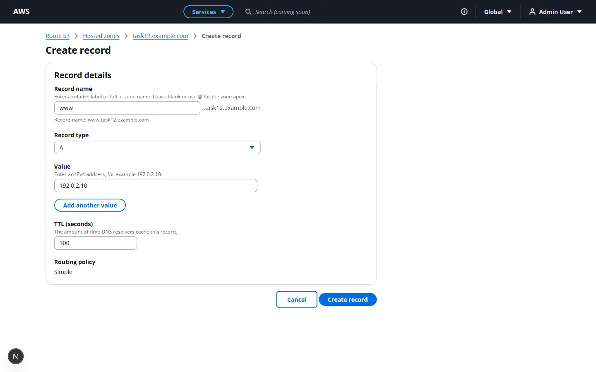
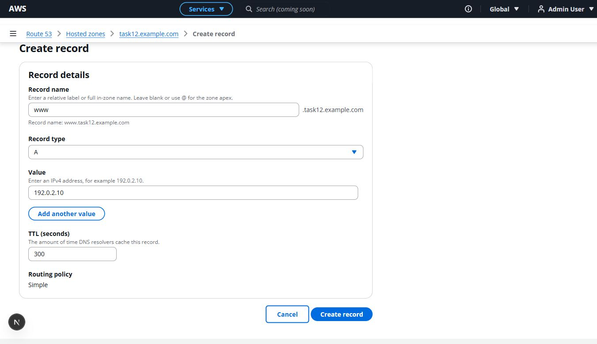
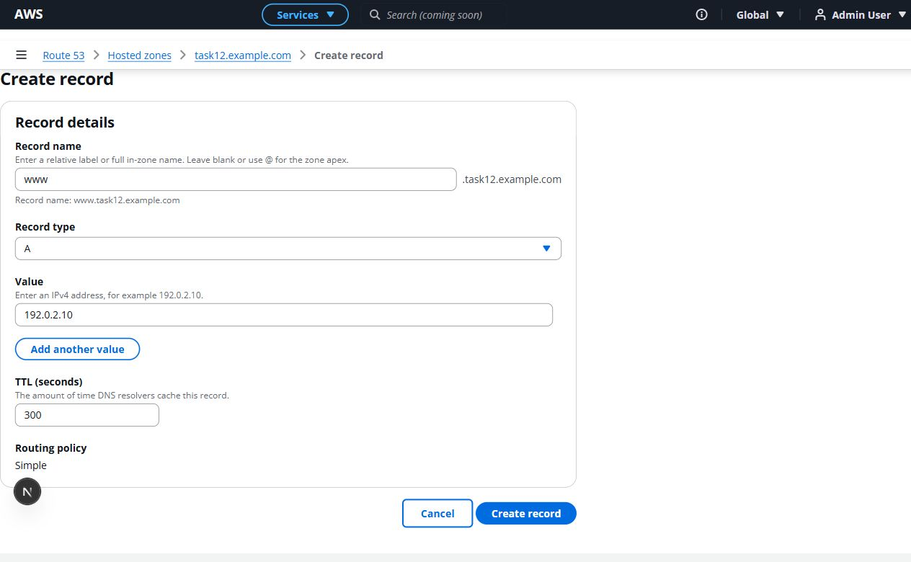
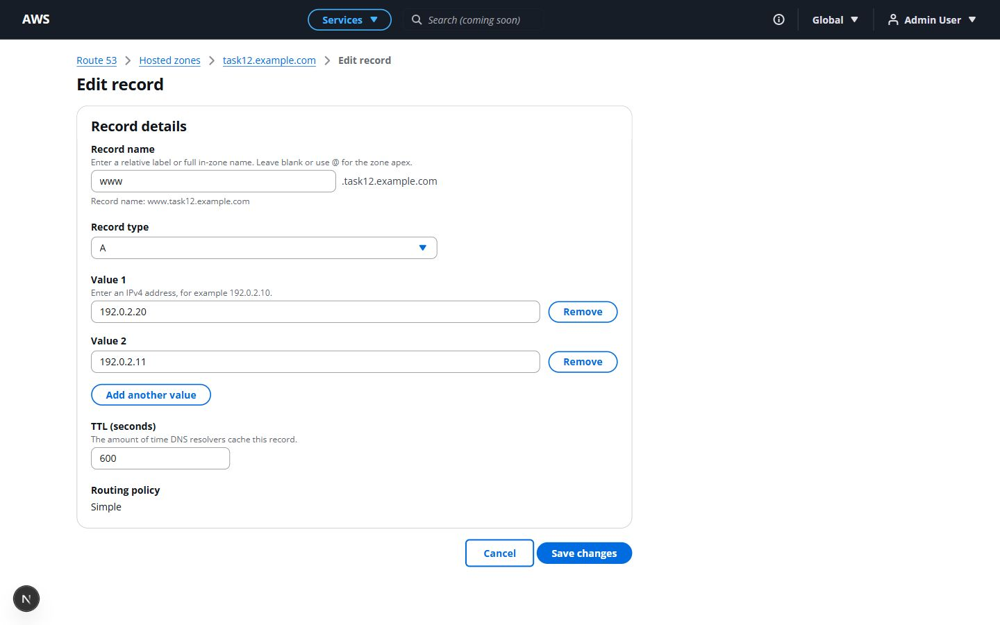
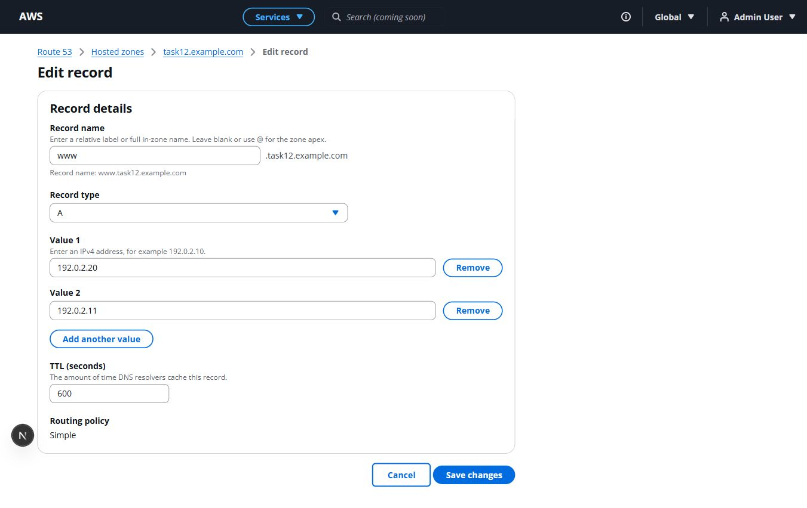
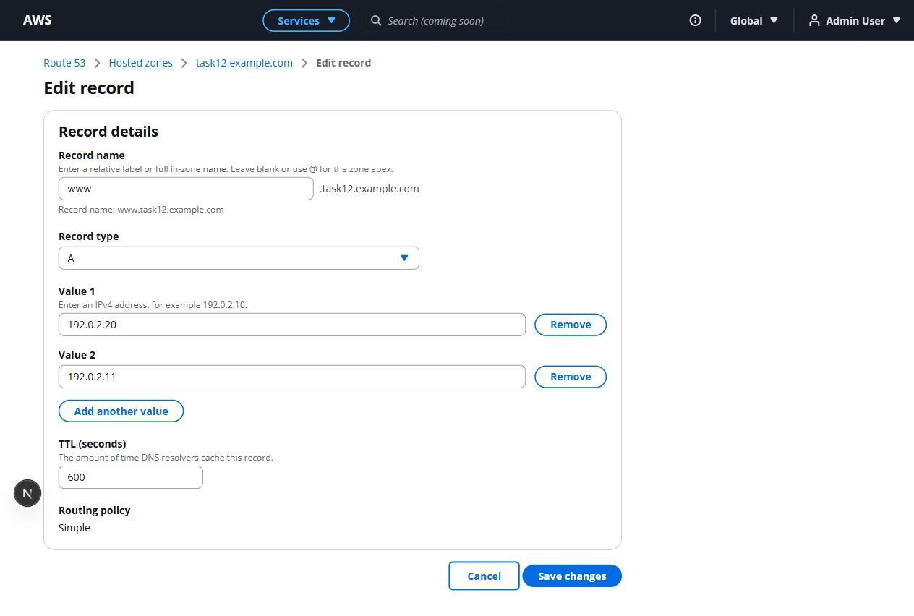
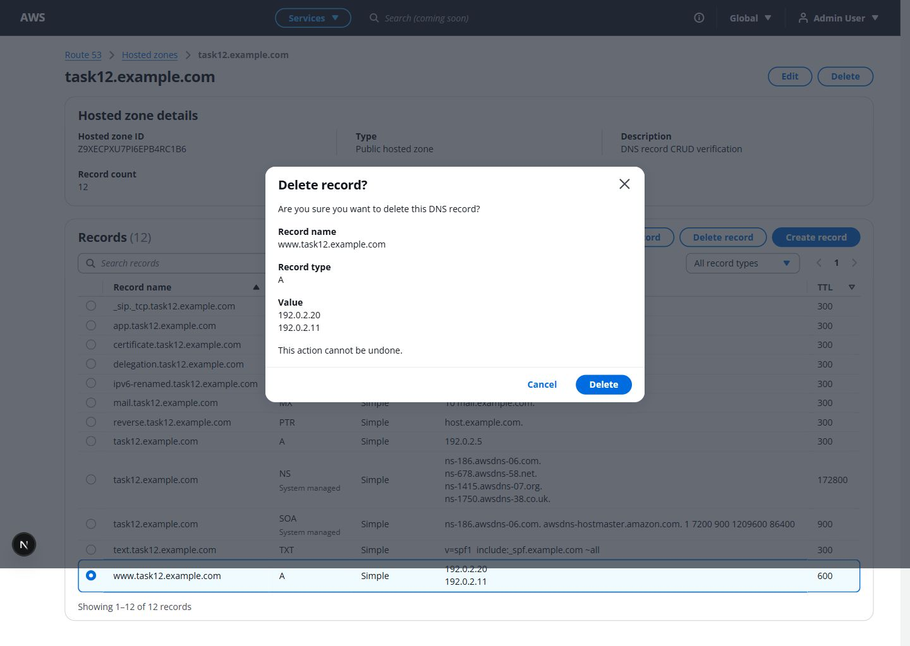
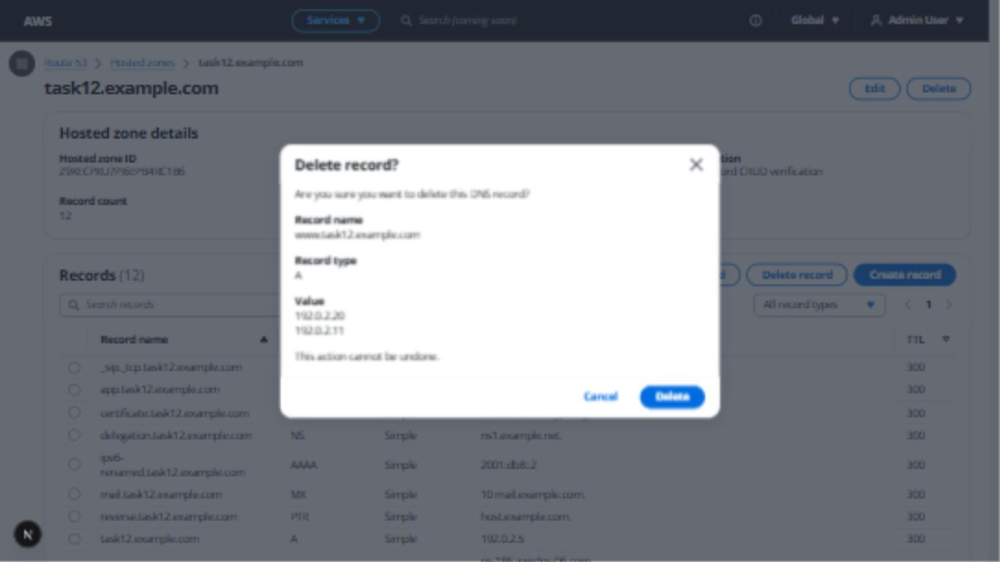
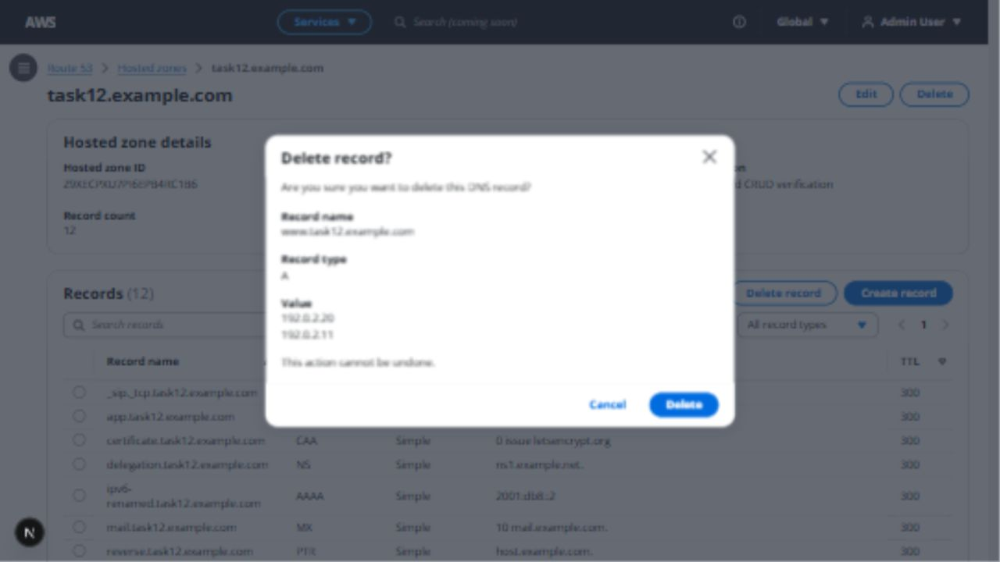
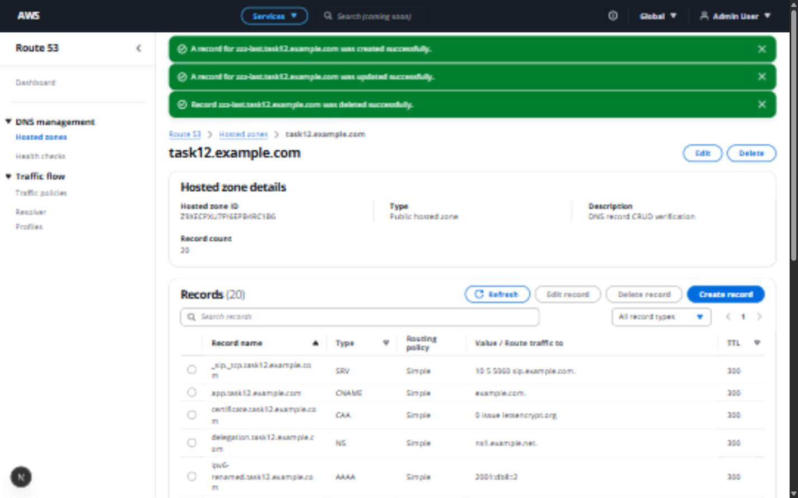

# Task 12 verification — DNS Record frontend CRUD

Verified on 2026-10-09 against the local Next.js frontend and real FastAPI/SQLite
backend. No backend application, migration or test files changed: all 52 SHA-256
hashes match the pre-task baseline. The approved shell and existing table columns,
search, filtering, sorting and pagination remain intact.

## Implementation

- Create/edit routes independently fetch Hosted Zone and record resources.
- `DNSRecordEditor` owns resource states, mutations, notification and navigation.
- `DNSRecordForm` shares create/edit fields, validation, pending guards and errors.
- `DNSRecordValuesInput` uses stable row IDs, preserves other values on removal,
  keeps at least one row, and uses textareas for TXT.
- `lib/validation/dns-records.ts` normalizes names and validates the nine user
  types against the backend's supported shapes and limits.
- `lib/api/dns-records.ts` uses the existing configured, credentialed client.
- `recordErrorFeedback` transforms FastAPI 422 errors and handles 404/409/5xx
  and rejected network requests. Mutation 401 responses reuse `refreshUser`.
- `DeleteDNSRecordModal` uses Cloudscape focus management, readable values,
  protected-record and duplicate-request guards, loading and retry states.
- Existing shared Flashbar persists across create/edit navigation. After delete,
  the table and zone metadata refetch; counts are never modified locally.
- Last-row deletion on page two returns to page one without an invalid page.

## Requested manual flow matrix

| # | Flow | Observed result |
| --- | --- | --- |
| 1 | Create A | Created `www`, returned to detail with success Flashbar and backend count 3. |
| 2 | Multiple A values | `.10` and `.11` persisted/displayed; adding/removing a third row preserved both. |
| 3 | Invalid A | `999.999.999.999` blocked with field feedback. |
| 4 | Create AAAA | `2001:db8::1` created successfully. |
| 5 | Invalid AAAA | `2001:::xyz` blocked. |
| 6 | Create CNAME | `app` targeting `example.com` succeeded; backend canonical trailing dot displayed. |
| 7 | Apex CNAME | Blank/apex name blocked with clear explanation. |
| 8 | Multiple CNAME values | Submission blocked until extra value removed. |
| 9 | Create TXT | SPF text succeeded; meaningful double internal spaces retained. |
| 10 | Create MX | `10 mail.example.com` succeeded. |
| 11 | Invalid MX | Missing priority blocked. |
| 12 | Create NS | Ordinary `delegation` NS target succeeded and remained mutable. |
| 13 | Create PTR | `host.example.com` target succeeded. |
| 14 | Create SRV | Relative `_sip._tcp` with `10 5 5060 sip.example.com` succeeded. |
| 15 | Invalid SRV | Port 70000 blocked. |
| 16 | Create CAA | `0 issue letsencrypt.org` succeeded; flags 256 blocked. |
| 17 | No creatable SOA | Form select contained exactly the nine user types, without SOA. |
| 18 | Duplicate record | Real backend 409 for full `www.task12.example.com.` + A showed “already exists. Edit the existing record instead.” |
| 19 | Cancel create | Dirty form returned to detail without adding a record. |
| 20 | Edit A values | `.10` changed to `.20`; second `.11` value preserved. |
| 21 | Edit TTL | 300 changed to 600, visible in refreshed table. |
| 22 | Invalid edit | Frontend invalid IP and injected backend 422 retained entered values/TTL. |
| 23 | Cancel edit | Unsaved TTL 900 did not replace saved 600. |
| 24 | Normal record Edit | Table selection opened the selected UUID's edit route. |
| 25 | System NS Edit | Action disabled; direct route rendered protected message with no form. |
| 26 | System SOA Edit | Same disabled action and direct-route protection. |
| 27 | Delete normal record | Confirmation opened before any DELETE; name/type/value shown. |
| 28 | Cancel delete | Record remained, including after multi-value modal review. |
| 29 | Confirm delete | Temporary `zzz-last` removed, success Flashbar and backend count refreshed. |
| 30 | System NS Delete | Semantically disabled selection action. |
| 31 | System SOA Delete | Semantically disabled selection action. |
| 32 | Protected backend 409 | Injected protected-record 409 displayed cleanly inside modal; row retained. |
| 33 | Refresh create route | Session persisted and zone/form loaded independently. |
| 34 | Refresh edit route | Session persisted; name, type, both values and TTL reloaded. |
| 35 | Network failure | Create/edit/delete rejected requests showed usable error, retained form/modal, and allowed retry. |

Additional checks: blank apex A and @ equivalence; spaces, protocol, malformed
labels and out-of-zone names rejected; full in-zone name does not duplicate
suffix; CNAME URL target rejected; TTL zero blocked; keyboard Enter submission;
name/type changes AAAA → TXT → AAAA permitted by real PATCH API; missing UUID and
actually deleted-record edit routes show Record not found; fake zone reuses
Hosted zone not found. Mutation 401 redirected through existing auth to login,
and a fresh demo login restored the protected console.

Create/edit/delete slow responses kept submit and cancel disabled while pending.
Create 500 and delete 500 showed general errors without raw backend JSON.
Delete failures retained the modal; retry subsequently succeeded. Multi-value
confirmation showed two values on separate lines. Search for `www`, NS filtering,
TTL sorting, refresh and resetting filters still worked after mutations.

Pagination recovery used eight temporary A records to produce 21 rows. Deleting
the sole row on page two returned to page one with 20 rows and matching metadata.
The eight temporary pagination records were subsequently removed through the API,
leaving the review zone at 12 records.

## Failure simulation method

A temporary ASGI wrapper outside the repository delegated ordinary requests to
the original FastAPI app. Scoped flags intercepted only this review zone's record
mutation requests for 422, protected 409, 500, 401 and a two-second delay. The
network case deliberately omitted CORS headers so the browser rejected the
request into the API client's network-error branch; this was a simulated network
rejection, not a physical offline test. The wrapper denied requests rather than
bypassing authentication. It also denied `/api/auth/me` for the 401 case.

The wrapper was stopped after testing and the regular
`uvicorn app.main:app --reload --host 127.0.0.1 --port 8000` restored. No fault
wrapper or testing flag is included in application source or the runtime now.

## Automated regression results

| Check | Result |
| --- | --- |
| `npm run lint` | PASS, no warnings |
| `npm run typecheck` | PASS |
| `npm run build` | PASS, including both dynamic DNS editor routes |
| `npm test` | PASS, 6 focused tests covering name normalization, IP/type boundaries, TTL, CNAME cardinality, payload and edit initialization |
| `.venv/Scripts/python.exe -m pytest -W error -q` | PASS, 383 tests in 97.89 seconds |

No additional frontend test dependencies were installed. The focused tests use
Node's built-in test runner and the already installed TypeScript transpiler.

## Visual verification

Create, multi-value edit and delete confirmation inspected at 1440 × 900,
1366 × 768 and 1280 × 720. Fields remain left aligned and the form is capped at
800px; value inputs and Remove controls fit without overlap. Shorter viewports
scroll naturally to actions. The name suffix wraps when necessary. Cloudscape
breadcrumbs, compact titles, one Record details container, restrained helper text,
Cancel before primary action, standard modal and existing Flashbar maintain the
console's visual language. The approved shell/table styles were not redesigned.

This is an AWS-inspired supported subset rather than a pixel-identical editor:
Alias and advanced routing controls are omitted, Simple is static, and each TXT
value has its own textarea. In-app browser viewport captures are slightly soft;
full-page captures may show navigation collapsed and extend beyond the viewport.

## Review data and scope

The original five demo zones retain their names, descriptions, visibility,
private metadata and zero-record counts. `task11.example.com` retains its six
records. The new `task12.example.com` zone (`Z9XECPXU7PI6EPB4RC1B6`) is retained
for review with twelve records: generated NS/SOA, nine user types and apex A.
Temporary `zzz-last` and eight pagination records have been removed.

No Alias UI, advanced routing, SOA creation, bulk operations, import/export,
dark mode, shortcuts, dashboard work or general refactoring was started.
