# Task 13 verification — application polish

Verified 2026-10-09 using the running Next.js application and real FastAPI API.
The backend application, migrations and tests remain unchanged: all 52 file
hashes match the pre-task baseline. No backend endpoints or dependencies added.
README finalization, repository reorganization, bonuses and deployment were not
started.

## Changes

- `Route53Dashboard` replaces the header-only landing page with Cloudscape DNS
  management and Health checks / Traffic flow / Resolver / Profiles sections.
- Hosted-zone count uses the existing owner-scoped list API with `page=1` and
  `page_size=1`, displaying its total. Cross-zone DNS record totals are omitted
  rather than scanning zones or adding backend functionality.
- View hosted zones and Create hosted zone use existing resource routes.
  Secondary service links navigate to their corresponding availability pages.
- Four secondary pages now use the shell, breadcrumbs, sentence-case headers,
  a restrained About container and a neutral Not implemented status. Their text
  explicitly describes the demonstration's scope without fake controls.
- Top navigation retains its branding, Global label, user and sign out. Removed
  unsupported More services / Account / Settings menu entries and development
  wording. Console search is visibly disabled with an accessible availability
  label rather than pretending to work.
- Hosted-zone search is labeled Search hosted zones, matching Search records.
  Both no-match descriptions refer consistently to search or filters.
- Record create/edit success text now matches deletion: Record NAME was created,
  updated or deleted successfully. All use the existing Flashbar provider.
- Success notifications remain user-dismissible, retain their lifetime across
  navigation, and expire after 30 seconds. The existing maximum of four prevents
  unbounded accumulation. Error alerts do not auto-dismiss.
- Hosted-zone Refresh clears selection. Pending searches hide stale selections.
  Last-row deletion on a later page returns to the previous page. Out-of-range
  pagination is disabled while its existing first-page recovery action is shown.
- Removed the obsolete edit-placeholder hook comment and outdated Hosted Zone
  description in navigation configuration.

Existing forms, record validation, modals, resource hooks, API/auth infrastructure,
table columns/density and shell layout were preserved. No architectural refactor
or new state library was introduced.

## Manual verification

| Flow | Result |
| --- | --- |
| Unauthenticated root | Redirects to login; protected content not displayed. |
| Invalid credentials | Clean Invalid email or password feedback; password cleared. |
| Valid login / authenticated root | Dashboard loads; root redirects to `/route53`. |
| Dashboard summary | Real total 7 initially, 8 after verification-zone creation, 7 after cleanup. |
| Dashboard actions | View opens listing; Create opens existing zone form. |
| Zone search / no matches | Results and totals update; Clear filters restores listing. |
| Zone selection / Refresh | Edit enabled for selection, disabled after Refresh. |
| Create zone | Public `zzz-task13.example.com` created with success Flashbar and 2 system records. |
| Create A | `www` / `192.0.2.13` created; table and backend metadata count 3. |
| Record search / type filter | `www` search and A filter target the normal record. |
| Edit record | IP changed to `192.0.2.23`, TTL to 600; new values and Flashbar visible. |
| Delete record | Confirmation precedes DELETE; success refreshes count to 2 and clears selection. |
| Edit zone | Description updated successfully; detail and Flashbar refreshed. |
| System protection | NS/SOA actions disabled; direct NS edit URL shows protected message without form. |
| Zone deletion / pagination | Seeded 13 temporary zones to produce 21 rows; deleting sole page-two verification zone returns to page one with 20. |
| Cleanup | Removed all 13 seeded zones; original seven zones and Task 11/12 review records preserved. |
| Empty description | Existing `api.example.com` shows an em dash. |
| Empty records | Legacy zero-record zone shows No records with Create record action. |
| Private zone metadata | Region displays Asia Pacific (Mumbai) and VPC ID; public details hide irrelevant private fields. |
| Service navigation | All four dashboard links and Route 53 breadcrumb return actions work. |
| Active navigation | Dashboard and Health checks observed with `aria-current=page`; existing resource-parent matching remains intact. |
| Success expiry | Notification remained through client navigation and subsequently disappeared; no accumulated stack remained. |
| Dashboard API outage | Stopped local Uvicorn temporarily; summary showed contextual error/Retry, other sections and links remained usable. Restarted regular API; Retry restored count. |
| Logout | Account menu sign out returned to `/login`. |

The temporary end-to-end Hosted Zone was `ZIC1P1LKIUS2W6UOXYN7R`. It and its
associated records were removed through the existing confirmed deletion flow.
Temporary pagination zones were created/removed via the real API as test setup.
No existing zone or review record was edited or deleted.

## Visual and accessibility review

Inspected login, dashboard, Hosted Zones listing, Hosted Zone detail/create and
Health checks at 1440 × 900 and 1366 × 768. Also inspected existing DNS edit/delete
at 1280 × 720, dashboard at that size, and dashboard/navigation/tables/forms at
390 × 844. Narrow navigation opens/closes; tables scroll internally; actions
wrap; form controls fit. DOM width checks showed no document-level horizontal
overflow in the narrow dashboard, Hosted Zones table or record form.

Existing form field labels, keyboard submission, standard Cloudscape focus
styles, semantically disabled actions, modal focus management and Flashbar
dismissal remain intact. New dashboard links/buttons are semantic controls,
section titles form an h1/h2 hierarchy, and summary loading has a status region.

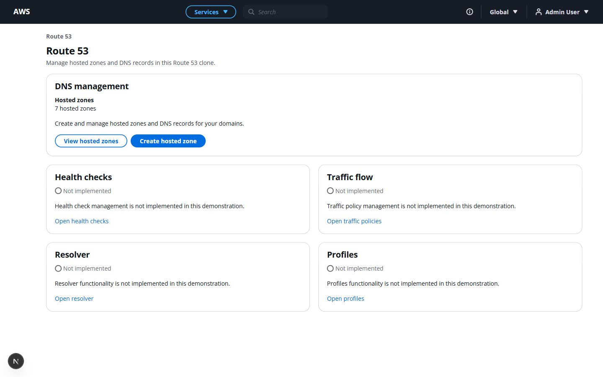
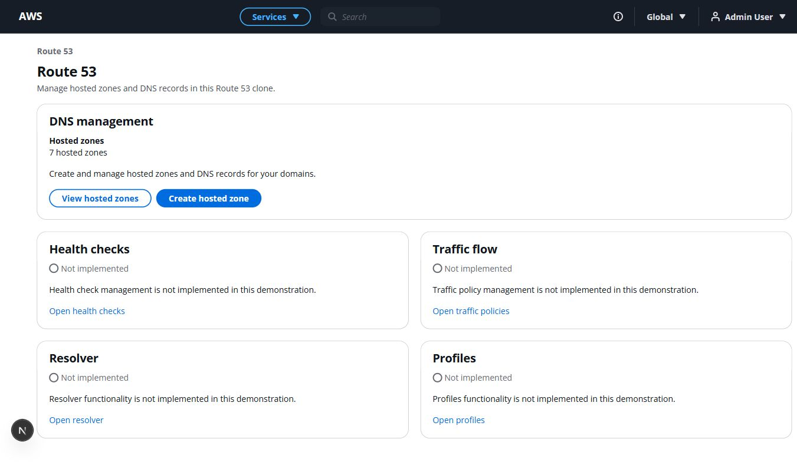
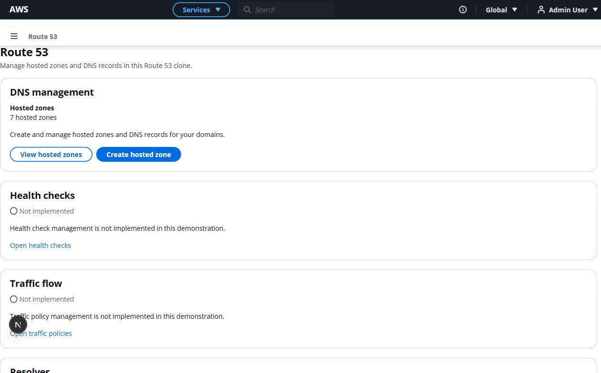
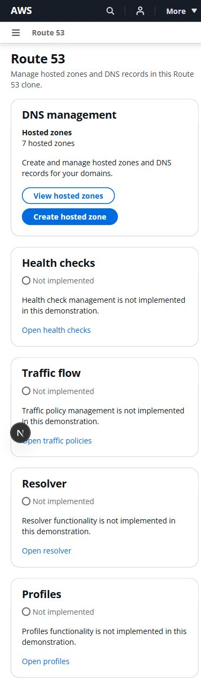
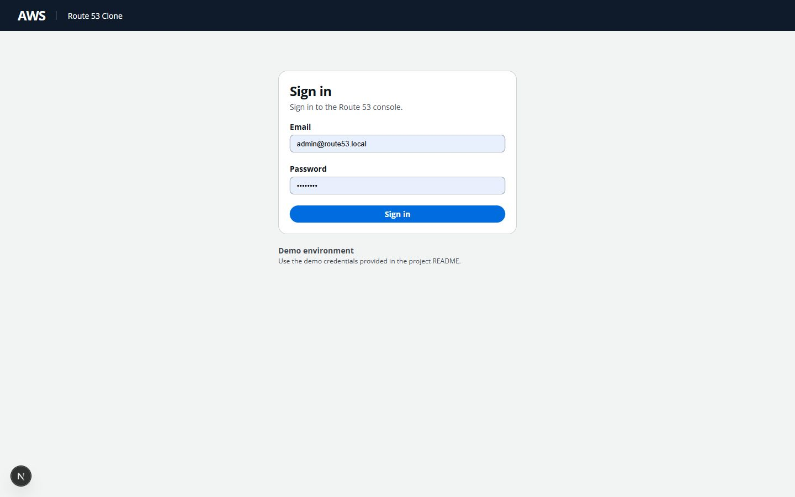
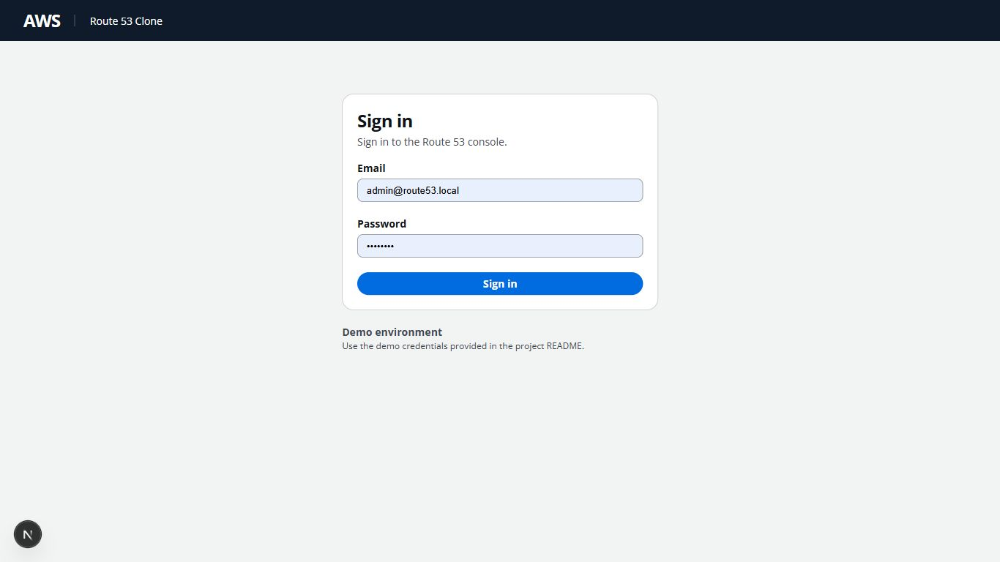
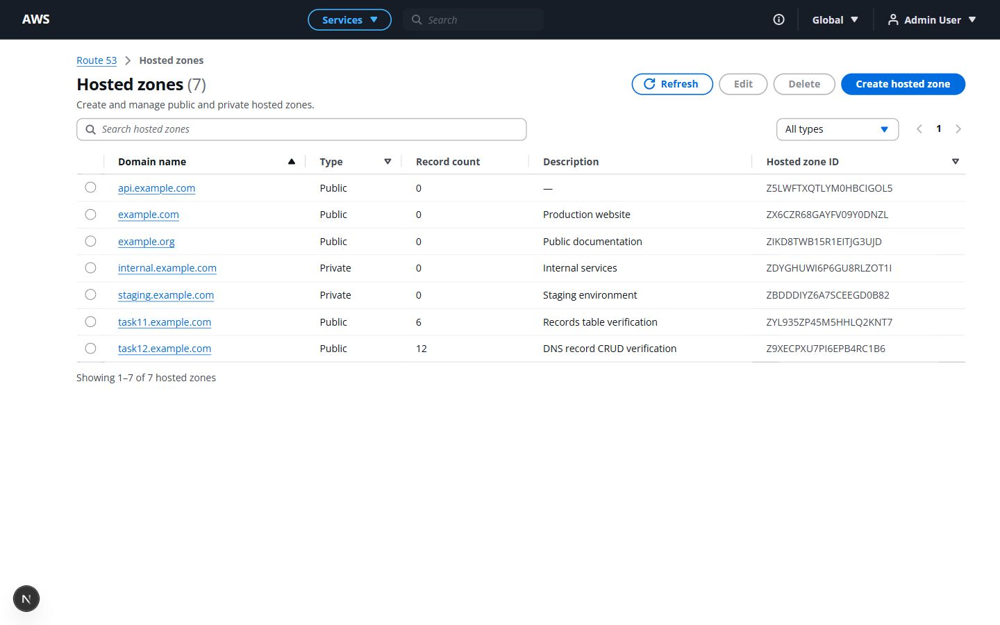
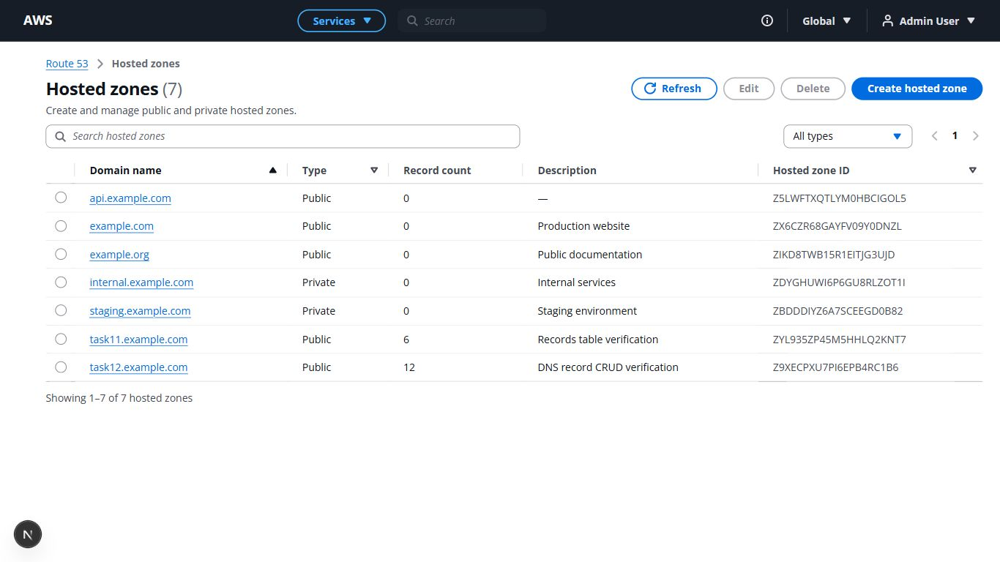
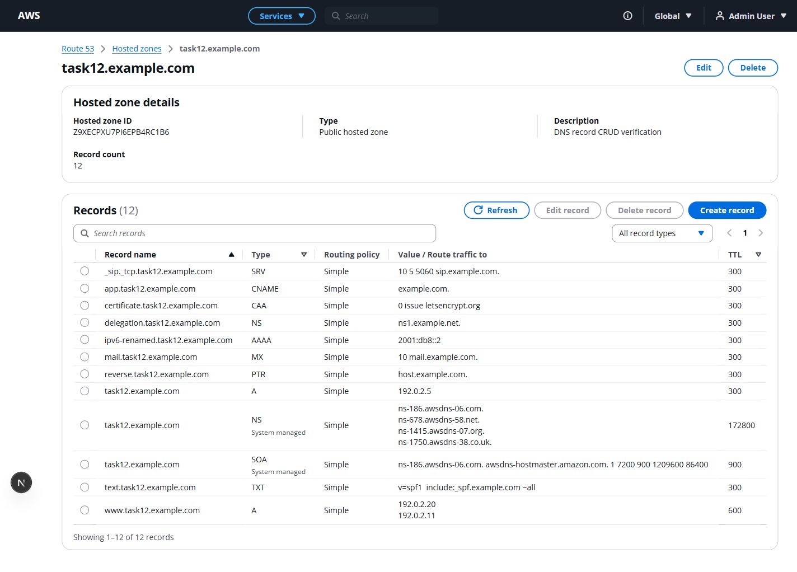
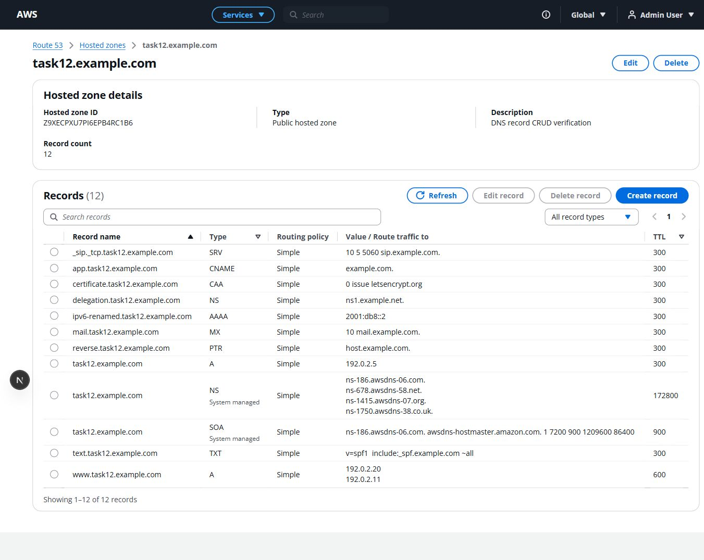
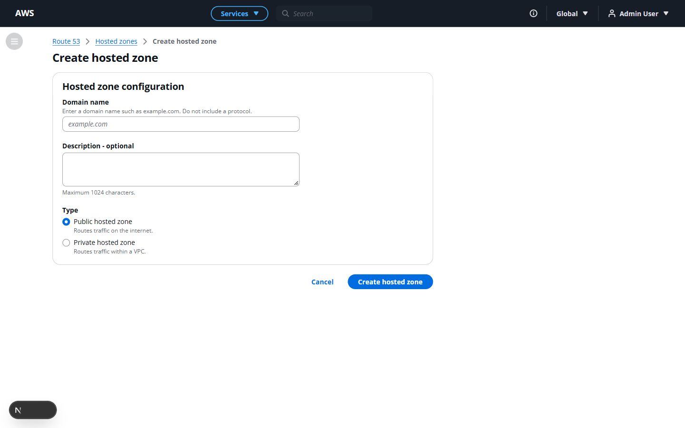
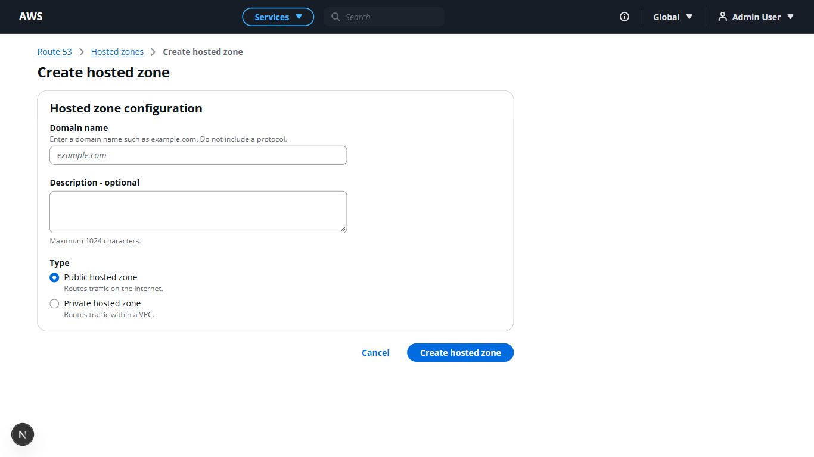
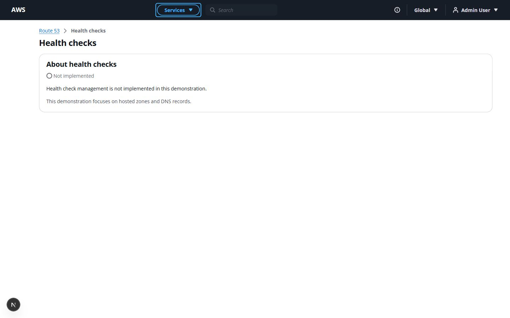
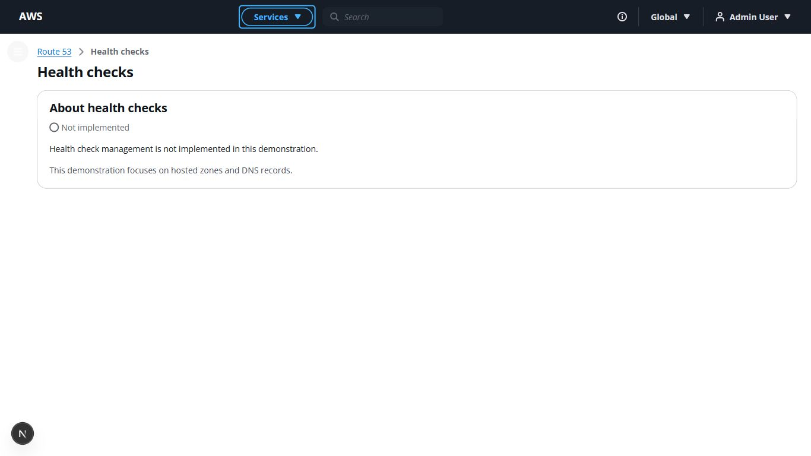
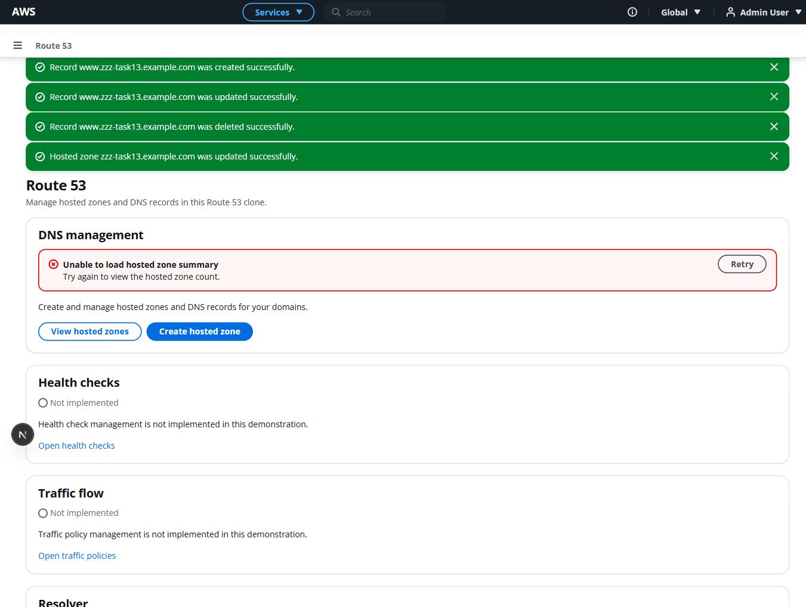

## Regression results

| Check | Result |
| --- | --- |
| Frontend lint (`--max-warnings=0`) | PASS |
| Frontend typecheck | PASS |
| Frontend tests | 6 passed |
| Frontend production build | PASS, all routes generated |
| Backend pytest (`-W error -q`) | 383 passed in 185.67 seconds |
| Backend file preservation | 52 unchanged hashes; no added backend files |

Source scan found no development console.log/console.debug/console.error calls,
TODO/next-phase/debug wording or outdated coming-soon text in completed UI areas.
Input placeholder props remain purposeful. No React key, hydration,
controlled/uncontrolled or unhandled-promise warnings were observed during the
flow.

One dependency development warning remains: Cloudscape's narrow AppLayout
navigation button overrides its own `aria-haspopup` attribute. The installed
`app-layout/visual-refresh/mobile-toolbar.js` passes it through native button
attributes while `button/internal.js` already defines the attribute. The
resulting navigation attribute and keyboard behavior are correct. Application
code does not override it. No vendor source was patched or console warnings
suppressed to hide this dependency issue.

Both development services are running normally. The browser viewport override
was reset, and the session was signed out after the requested end-to-end flow.
