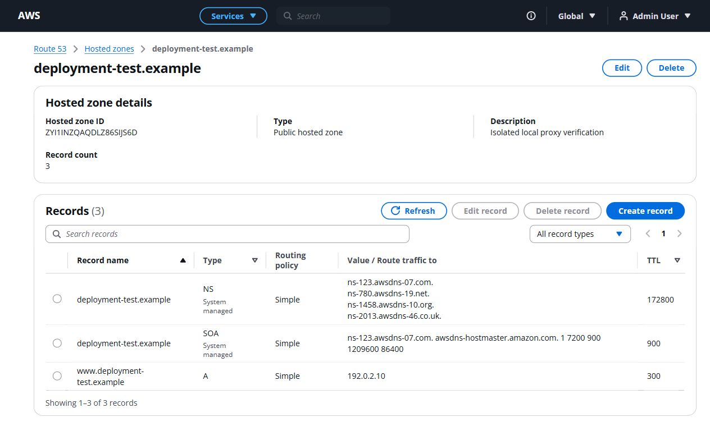

# Task 16: deployment preparation — public deployment pending

Verified locally on October 9, 2026. No public service, provider volume, or public URL has been created. There is no authenticated hosting CLI, hosting token environment variable, or provider browser session available on this machine. The workspace is not a Git repository. Account/plan availability must be established before selecting and creating hosting resources.

## Proposed topology

The candidate is two Railway services: Next.js frontend and one FastAPI backend with an attached persistent volume. Railway supports uploading local source using its CLI without requiring a Git remote. The actual account and plan have **not** been verified. No Railway service configuration or Docker files have been added pending that decision.

Current official documentation confirms [persistent volumes](https://docs.railway.com/volumes/reference), prohibits replicas for volume-backed services, and explains [CLI source uploads](https://docs.railway.com/cli/up). [Pricing](https://docs.railway.com/pricing) includes usage charges; a subscription price is not a cap on the cost of running both services. Confirm account eligibility, credit availability and budget before provisioning.

```text
Browser -> HTTPS frontend /api/... -> Next.js rewrite -> FastAPI
                                                -> SQLite on backend volume
```

Browser requests are same-origin. FastAPI's existing host-only cookie has HttpOnly, Path=/ and SameSite=Lax; production requires Secure=true. Because Set-Cookie has no Domain attribute, a proxied login sets the cookie on the frontend-visible host. Subsequent /api requests include it using the existing credentials=include client. No third-party cookie dependency or SameSite=None is necessary for this topology.

FRONTEND_ORIGIN must be the exact public frontend origin. The backend retains explicit credentialed CORS and its trusted-Origin write protection; no wildcard is introduced. A login through the backend's own Swagger UI would have a separate host-only session on the backend host.

## Prepared changes

- `frontend/lib/config.ts`: production defaults to an empty API base, producing relative /api URLs. Development keeps its existing localhost default. Explicit API bases remain supported.
- `frontend/next.config.ts`: optional server-only API_PROXY_TARGET rewrites /api/:path* to the backend, preserving paths and query parameters. It rejects credentials, non-HTTP protocols and path/query/fragment-bearing origins. The destination is build-time configuration; rebuild when changing it.
- `backend/app/scripts/start_production.py`: rejects missing/unmounted storage, the root filesystem, relative/in-memory/non-SQLite/out-of-volume database paths, missing parent directories, unwritable storage, insecure cookie/frontend settings and invalid/missing PORT. It never creates an ephemeral fallback database.
- Startup runs Alembic upgrade head, then the existing idempotent demo-user seed, then execs Uvicorn on 0.0.0.0 with the provider port and one worker. Any setup failure stops startup.
- Deployment-specific frontend and backend regression tests cover configuration and failure behavior. `.env.example` files contain instructions, not production credentials. Additional SQLite extensions are ignored.

## Environment contract for the eventual deployment

Nothing has been configured on a hosting provider yet.

| Service | Variable | Configuration rule |
| --- | --- | --- |
| Frontend | API_PROXY_TARGET | Actual backend origin, configured **before npm run build**; available on server only |
| Frontend | NEXT_PUBLIC_API_BASE_URL | Unset or empty for same-origin production requests; remove the localhost value copied from the local example |
| Frontend | PORT | Provider port used by Next.js start |
| Backend | APP_ENV | Production |
| Backend | DATABASE_URL | Absolute SQLite file URL within the actual mounted volume |
| Backend | SQLITE_VOLUME_PATH | Existing persistent volume mount point; not an ordinary application directory |
| Backend | FRONTEND_ORIGIN | Actual HTTPS frontend origin, without a path |
| Backend | SESSION_COOKIE_SECURE | True |
| Backend | PORT | Provider-assigned port |
| Backend | DEMO_USER_EMAIL, DEMO_USER_PASSWORD, DEMO_USER_DISPLAY_NAME | Configure evaluator credentials in provider environment; seed does not change an existing user |
| Backend | SESSION_COOKIE_NAME, SESSION_TTL_HOURS, APP_NAME | Existing optional settings; defaults may be retained |

The backend start command is `python -m app.scripts.start_production`. Run it from backend/. Mount availability must be checked **at startup**, since provider build or pre-deploy hooks may not have the volume attached. Mounting /data would correspond to sqlite:////data/route53.db, but that is an example path, not a provisioned volume. Do not enable replicas, autoscaling or multiple workers. Configure /health as the backend health check.

## Actual local verification

The normal development backend/database on port 8000 was preserved. Verification used a fresh SQLite file outside the repository, backend port 8001 and Next.js **production build** on port 3001. The local backend used development HTTP cookie settings; this is not proof of public HTTPS cookies or cloud-volume persistence.

- Pre-change frontend lint, typecheck, 12 tests and production build passed; pre-change backend suite: **383 passed**.
- After changes frontend lint, typecheck, **15 tests**, and production build passed. This build used an explicitly configured local rewrite target for isolated testing.
- Final backend suite with warnings treated as errors: **398 passed in 218.71 seconds**.
- Fresh Alembic migrations applied 0001_core_tables and 0002_record_set_uniqueness. Demo seed created one user; repeat seed reported the existing user.
- Browser login through /api succeeded; dashboard displayed zero initial hosted zones.
- Browser created deployment-test.example (ID ZYI1INZQAQDLZ86SIJS6D) and www.deployment-test.example A record, value 192.0.2.10, TTL 300. Automatic NS and SOA were visible.
- The isolated backend process was stopped and started again against the same database. Migration remained at head and the seed reported the existing user. Reloading the resource page retained authentication and showed the same zone, system records and A record. Before restart: one user, one session, one zone and three records.
- Browser changed A value to 192.0.2.20, searched www, filtered A, deleted the A record with confirmation, edited the zone description, searched hosted zones, and refreshed the direct record-create route while authenticated.
- Deletion from the list removed the disposable zone and its remaining system records; stale selection cleared. Browser sign-out then direct hosted-zone navigation returned to login.
- After cleanup the isolated database contained one user, zero sessions, zero hosted zones and zero records. The normal development database remained at seven hosted zones and eighteen records. Both isolated verification services were stopped; the existing services on ports 3000 and 8000 were preserved.
- Wire-level HTTP checks verified proxy login Set-Cookie forwarding, credentials on /me, query parameter forwarding, untrusted-Origin rejection, logout invalidation, public health/docs/OpenAPI and explicit credentialed CORS. Local cookie: route53_session, HttpOnly=true, Secure=false for local HTTP, SameSite=Lax, Path=/, host-only localhost. No raw token was printed.
- Production-build browser warning/error log was empty during this local verification.
- The candidate Railway dashboard was opened and displayed its Login dialog. No service creation, account upgrade, source upload or payment was performed. The login tab was left open for handoff.



## Required public verification still outstanding

1. Obtain access to the selected provider account and confirm its available persistent-storage plan/budget. Provision backend first, attach its actual volume, and set the environment contract above. Reserve/generate the frontend HTTPS origin so the backend can enforce the correct Origin.
2. Verify mounted storage and startup logs, successful migration/seed, one backend instance, and public HTTPS /health and /docs.
3. Build and deploy frontend with the actual API_PROXY_TARGET and no localhost public API base. Verify both public HTTPS origins before adding any README links.
4. Inspect real production cookie attributes and browser network traffic. Verify Secure/HttpOnly/Lax/Path=/, frontend host-only behavior, cookie forwarding, no CORS/mixed-content/localhost/401 loops, login refresh, and logout.
5. Repeat the public CRUD/search/filter/direct-refresh/protected-route workflow in normal and private browsing. The available in-app browser does not expose a private-session or DevTools network/cookie API; use an available normal browser for those inspections.
6. Create deployment-test.example and an A record on the actual provider volume, restart/redeploy the actual backend, and verify the zone, user, NS/SOA, A record and session lifecycle. The local restart test does not replace this mandatory cloud test. Clean up the disposable production test resource afterward.
7. Update README with verified real frontend/API/Swagger/health URLs and the actual evaluator credentials only after deployment succeeds. No live links have been invented.

Provider sign-in and account/plan confirmation are the smallest missing human step. Task 16 remains incomplete until public deployment and these checks pass. Task 17 has not started.
