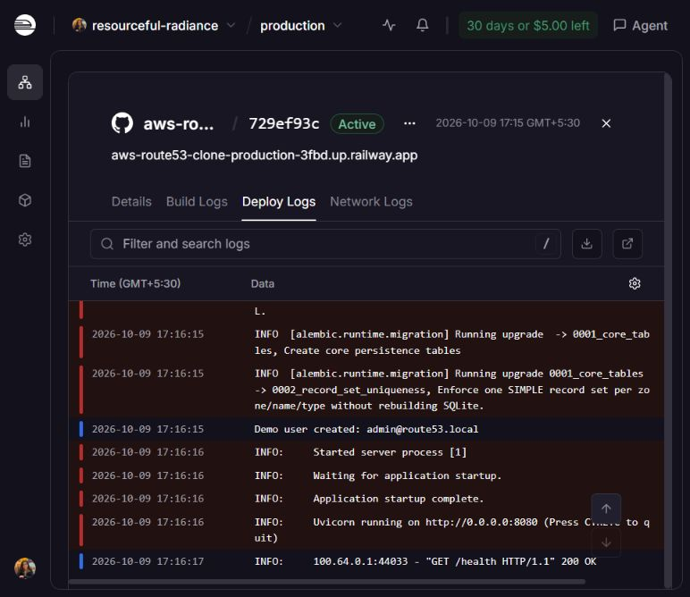
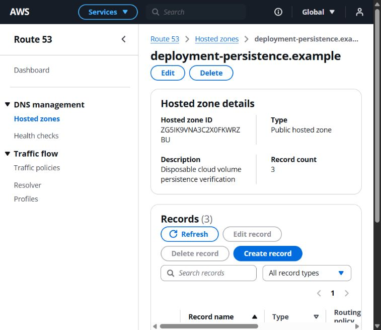

# Task 16: public deployment verification

Verified October 9, 2026 (Asia/Calcutta, UTC+05:30). **TASK 16 COMPLETE.** The verification used the public Vercel application and Railway backend, rather than localhost. No application code or authentication protections needed to change during this final deployment pass.

## Public entry points

| Purpose | URL |
| --- | --- |
| Live Demo — evaluator entry point | https://aws-route53-clone-ecru.vercel.app |
| Backend — technical reference | https://aws-route53-clone-production-3fbd.up.railway.app |
| Swagger | https://aws-route53-clone-production-3fbd.up.railway.app/docs |
| Health | https://aws-route53-clone-production-3fbd.up.railway.app/health |
| OpenAPI | https://aws-route53-clone-production-3fbd.up.railway.app/openapi.json |

Demo credentials: `admin@route53.local` / `admin123`. This is an intentionally shared demonstration account. All disposable resources created during this verification were removed afterward.

## Configuration and architecture

```text
Browser -> Vercel HTTPS frontend -> same-origin /api/* rewrite
        -> Railway HTTPS FastAPI backend -> /data/route53.db
                                         on persistent Railway volume
```

Repository: `gitHubPalak21/aws-route53-clone`, branch `main`. Vercel root directory is `frontend`; its intended server-only proxy target is `https://aws-route53-clone-production-3fbd.up.railway.app`, with `NEXT_PUBLIC_API_BASE_URL` unset/empty. The public proxy was verified by successful authentication and resource API requests through the Vercel origin. Vercel's account dashboard was signed out in the available browser, so its project environment settings were not independently read in this pass.

Railway provider settings were inspected directly:

| Setting | Verified value |
| --- | --- |
| Project / service | `resourceful-radiance` / `aws-route53-clone` |
| Environment | `production` |
| Backend root | `/backend` |
| Start command | `python -m app.scripts.start_production` |
| Healthcheck | `/health` |
| Volume | `aws-route53-clone-volume`, mounted at `/data` |
| Database URL | `sqlite:////data/route53.db` |
| Volume path | `/data` |
| Application environment | `production` |
| Secure session cookie | `true` |
| Frontend origin | `https://aws-route53-clone-ecru.vercel.app` |
| Port | Railway-supplied `8080`; confirmed by runtime listener |
| Replicas / Uvicorn workers | `1` / `1` |

The stable Vercel origin was applied to Railway and deployed. HTTPS validation, exact-origin CORS, trusted-Origin checks, and the mounted-volume guard remained enabled.

## Railway deployment and startup

Deployment **`729ef93c-7e63-4243-b544-8d73409376a1`**, created October 9 at approximately 17:15 UTC+05:30, became **Active**. Runtime logs showed the provider volume mount, SQLite Alembic migration initialization, both schema migrations (`0001_core_tables` and `0002_record_set_uniqueness`), successful demo-user creation, application startup completion, and Uvicorn listening on `0.0.0.0:8080` with process `[1]`.

The production script validates environment and mounted storage before migrations. There is no separate success log for each guard; reaching migrations and Uvicorn confirms startup passed those checks. Public `/health` returned **200**, `/docs` returned **200** with Swagger UI, and `/openapi.json` returned **200**.

An actual Railway **Restart** of this deployment was performed, rather than a browser reload. Logs at approximately **17:22:47–17:22:50 UTC+05:30** showed shutdown, the same volume mount, Alembic at the existing schema revision, `Demo user already exists`, and a new healthy Uvicorn process. Restart retained the deployment ID.



## Authentication and cookie checks

Public browser verification covered invalid login feedback, demo login, dashboard refresh, resource-page refresh, direct create-record route refresh, logout, and protected-route redirection. After logout, direct hosted-zone navigation rendered the session-check state and redirected to `/login?next=%2Froute53%2Fhosted-zones`; login refresh did not restore the session. The unauthenticated root route also redirected to login.

Independent public HTTP checks through the Vercel `/api/*` proxy confirmed:

- Invalid login: **401**; valid demo login: **200**.
- `/api/auth/me`: **401** before login, **200** after login, **401** after logout.
- Login JSON contained the user only, with no authentication token returned.
- The actual proxied session cookie had **HttpOnly**, **Secure**, **SameSite=Lax**, **Path=/**, and no Domain attribute (host-only).
- Logout cleared the cookie with `Max-Age=0`; replay of the prior cookie also returned **401**, confirming server-side invalidation.
- The cookie values were held only in memory for wire-level tests, never printed or written to verification artifacts.

Source review confirmed credentialed requests, no authentication tokens in localStorage/sessionStorage, hashed passwords, and hashed session tokens in the database.

## Public resource workflows

| Workflow | Observed result |
| --- | --- |
| Public hosted zone | Created `deployment-test.example`; generated NS/SOA and record count 2 |
| Hosted-zone edit | Updated description to `Verified public deployment update`; refreshed detail preserved it |
| Hosted-zone search | Matching search returned the persistence zone; unmatched search showed No matches; Clear filters restored results |
| Private hosted zone | Created `deployment-private.example` with `ap-south-1` and `vpc-0123456789abcdef`; Mumbai/VPC metadata and NS/SOA displayed |
| A record create | Created `www` with `192.0.2.10`, TTL 300; zone count became 3 |
| A record edit | Prepopulated form updated the value to `192.0.2.20` |
| Record search/filter | `www` plus A type returned the matching record; the filtered header count was 1 |
| Record delete | Cancel kept the record; confirmed deletion removed it and reset selection; zone count became 2 |
| Hosted-zone delete | Confirmation removed each disposable zone and redirected to the list with Flashbar feedback |
| System protection | Selected NS/SOA disabled Edit/Delete; direct API PATCH and DELETE returned **409** for both system records |
| Other navigation | Health checks, Traffic policies, Resolver, and Profiles all rendered their intended unavailable-service pages |

All three verification zones were deleted after the tests, including the persistence zone and its records. The hosted-zone list returned to its initial empty state.

## Mandatory restart persistence test

Created **`deployment-persistence.example`**, hosted-zone ID **`ZG5IK9VNA3C2X0FKWRZBU`**, with description `Disposable cloud volume persistence verification`, its NS/SOA records, and a `www` A record (`192.0.2.10`, TTL 300). Zone record count was 3.

| Resource | ID verified unchanged after restart |
| --- | --- |
| Hosted zone | `ZG5IK9VNA3C2X0FKWRZBU` |
| NS | `733c5913-dc59-4bec-81ea-49d72aed2b85` |
| SOA | `a2d7680a-9c14-440c-a6d6-f2ef196c03f5` |
| A | `28ac7a89-d301-403b-80d6-cc09048c78cb` |

After the actual provider restart, the public health endpoint returned 200. Public HTTP refetches matched the complete hosted-zone and record data captured before restart, including the IDs and values. Refreshing the existing public browser session also remained authenticated and displayed all three records. The resources were then deleted as cleanup.



## Browser and network QA

- Public workflows remained on the Vercel application; same-origin API calls succeeded through its proxy.
- Exact-origin credentialed CORS preflight succeeded with the canonical Vercel origin; an untrusted-origin login attempt was rejected with **403**.
- No mixed-content, CORS, hydration, React-key, uncontrolled-field, or unhandled-promise warnings appeared in captured public browser logs. Warn/error log queries returned an empty list.
- Production configuration defaults to relative API URLs, and the verified public API calls used Vercel `/api/*`, not localhost.
- Direct protected resource and create-record refreshes worked without route errors; logout/root redirection worked without loops.
- A browser network-waterfall API was not available. Network conclusions are based on public HTTP checks, configuration review, and browser console/workflow observations, rather than a saved HAR or inspected waterfall.

## Automated regression results

| Check | Result |
| --- | --- |
| Backend `python -m pytest` | **398 passed**, 94.81 seconds |
| Frontend `npm test` | **15 passed**, 0 failed |
| Frontend `npm run lint` | Passed |
| Frontend `npm run typecheck` | Passed |
| Frontend `npm run build` | Passed; static/dynamic App Router routes generated |

No application code changed after these checks. This final pass updates deployment documentation and evidence only. Earlier audit results remain in the historical Task 14–15 and deployment-preparation reports.

## Security and scope review

No passwords other than the intentionally public demo credential, raw sessions, provider tokens, local environment files, SQLite files, dependency directories, virtual environments, or build outputs are included in the documentation commit. Production HTTPS checks and mounted-storage validation remain intact; there is no wildcard credentialed origin or SameSite=None change. The existing development-tool dependency advisory is recorded in the README and was not bypassed by an unrelated dependency change.

There are **no known Task 16 blockers**. The backend remains a single volume-backed SQLite instance suitable for this assignment. Task 17, bonus features, architecture changes, and unrelated cleanup were not started.
