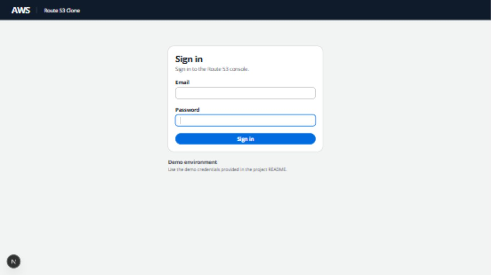

# Task 5 verification

Verified on 9 October 2026 with Next.js development mode at
`http://localhost:3000` and FastAPI at `http://localhost:8000`.
The browser used the seeded demo account and real API cookies. No browser cookie
was read, written or deleted through frontend JavaScript.

| Check | Result |
| --- | --- |
| Unauthenticated home | Redirected to `/login` after session check |
| Unauthenticated dashboard | Redirected to `/login`, service shell hidden |
| Unauthenticated hosted zones | Redirected to `/login?next=%2Froute53%2Fhosted-zones` |
| Other four protected routes | Health checks, traffic policies, resolver and profiles redirected with validated return-to paths |
| Required fields and keyboard submission | Field errors appeared, email received focus, Enter submitted |
| Wrong password | Stayed on login with generic alert; email preserved, password cleared |
| Valid login with return-to | Opened Hosted zones using real backend session |
| Dashboard refresh | Remained authenticated with backend display name |
| Nested-page refresh | Remained on Hosted zones |
| Login while authenticated | Redirected to dashboard without a usable login form |
| Authenticated home | Redirected directly to dashboard after session check |
| External return-to URL | Fell back to dashboard; no external navigation |
| Sign out | API logout succeeded, redirected to login |
| Protected dashboard after logout | Redirected to login |
| Login refresh after logout | Remained logged out |
| Backend unavailable: login | Accessible service-error alert; no crash |
| Backend unavailable: logout | Error shown, active user retained for retry |
| Backend unavailable: protected refresh | Console hidden, session-error alert and retry button |
| Backend restored | Retry recovered persisted session; sign-out then succeeded |
| Session request duplication | API log showed exactly one `/me` call on a controlled browser refresh |
| Responsive login | 1440×900, 1366×768, 1280×720, 390×844; no horizontal overflow |
| Approved service shell | Layout, navigation and placeholders preserved; account menu now uses backend identity |

Browser verification included URL waits, visible-heading/control assertions,
password-field metadata and cleared-value checks, and viewport overflow checks.
Expected 401 responses and deliberate connection-refused responses were handled
by the application; no application exception or redirect loop was observed.
The browser reported Cloudscape's native `aria-haspopup` override warnings in
the existing navigation components; no application errors were reported.

Validation commands: `npm run lint`, `npm run typecheck`, `npm run build`, and
`python -m pytest -W error`. All passed; backend result: **83 tests**.
The frontend has no existing test-runner infrastructure; no testing dependency
was added solely for this task.

Route protection is a shared client-side session guard. Server-component pages
remain server components, and future data endpoints must also enforce backend
authentication. Hosted Zone CRUD and other business features remain unimplemented.

