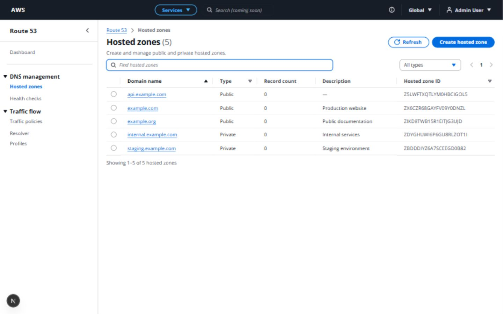

# Task 7 — Hosted Zones listing verification

Verified on 2026-10-09 against the running Next.js frontend and FastAPI backend.
The approved navigation, breadcrumbs, account menu, login, auth provider and
backend API remain intact. No new dependencies or test framework were added.

## Implementation

The server page retains metadata and composes a client HostedZonesTable.
Separate toolbar, empty/no-match state and minimal placeholder components keep
page composition readable. The API module uses the existing generic credentialed
client and URLSearchParams; types match the backend response. useHostedZones owns
request/loading/error/refetch behavior and delegates 401 recovery to the shared
auth provider/guard. AbortController, an active-request guard and query/revision
keys protect against old responses; the 350 ms search timer is cleared on changes
and unmount. Query state is local; URL synchronization and preferences are omitted.

The listing follows the [Cloudscape resource table pattern](https://cloudscape.design/patterns/resource-management/view/table-view/):
compact full-page Table, h1 header with backend count, upper-right primary action,
refresh, native search/type controls, sortable columns, single radio selection,
backend pagination, restrained formatting and useful empty/error states. Links
use the Next.js router through Cloudscape onFollow while preserving modified
click behavior. Async dynamic-route params follow the installed Next.js guide.

## Browser checks

Initial database state had zero hosted zones. The empty table showed **No hosted
zones**, a short explanation and a working creation-placeholder link. Twenty-five
public/private hosted zones were then created through authenticated backend API
requests to supply real persistent data for browser testing.

| Flow | Observed result |
| --- | --- |
| Initial listing | Header total 25; 20 rows; backend fields and zero record counts displayed |
| Null description | api.example.com shows an em dash |
| Pagination | Page 2 shows five rows and “Showing 21–25 of 25 hosted zones” |
| Search from page 2 | `internal` produces one result and returns to page 1; text is retained |
| No matches | Distinct No matches explanation and Clear filters button |
| Clear filters/search | Full collection restored |
| Private filter | Eight rows, all displayed as Private |
| Public filter | Seventeen rows, all displayed as Public |
| Domain sort descending | staging.example.com first; preview-20 precedes preview-19 |
| Type sort ascending | All eight Private rows precede Public rows |
| Selection | Space selects a row; header shows 1/25; selecting another replaces the first |
| Domain link | Enter navigates to the protected details placeholder with the matching zone ID |
| Create action | Opens the protected creation placeholder without a form |
| Return links | Back to hosted zones returns to the real listing |
| Refresh | Newly created backend rows appear without a browser reload |
| API outage | Stopping the local API yields safe inline error text and Retry; search remains intact |
| Retry recovery | Restarting the API and retrying restores the filtered result without reloading the browser |
| Browser reload | Session persists and 25 zones reload successfully |
| Expired session | Only the identified browser test session was expired; zone 401 triggers shared /me revalidation and login redirect |
| Sign-in after expiry | Returns to /route53/hosted-zones and loads the collection |
| Rapid search changes | Latest example.org query wins; clearing returns all remaining zones |
| Mobile navigation | Drawer opens and selecting Hosted zones closes it automatically |

Cloudscape receives native loading/loadingText and accessible labels for search,
refresh, selection, table and pagination. Sort state is exposed through aria-sort.
Request/timer cleanup was inspected for navigation and stale-response handling.
The browser console showed no application rendering errors; deliberate outage
and expired-session checks naturally generate failed-request messages.

After pagination checks, the twenty `preview-*.example.net` test zones were deleted
through authenticated API requests. Five real demo zones remain for review:
api.example.com, example.com, example.org, internal.example.com and staging.example.com.
There are no generated DNS records or frontend hardcoded rows. The browser was
left signed in on the completed listing, and the temporary viewport override
was reset.

## Visual inspection

| Viewport | Result |
| --- | --- |
| 1440 × 900 | All five columns visible; compact rows; actions/search aligned; no document overflow |
| 1366 × 768 | All columns visible; controls stay separate; no document overflow |
| 1280 × 720 | Table and shell remain aligned; no overlap or document overflow |
| 390 × 844 | Controls stack; navigation collapses; native table scrolls horizontally; document stays 390 px wide |

The clone uses the installed Cloudscape design version and the already-approved
shell. It is a close conceptual Route 53 resource listing; exact AWS console
release/theme details can differ. No custom table cards, gradients, extra shadows
or dashboard styling were introduced. Long descriptions are visually capped at
two lines with the full text available in a title; IDs can wrap without shortening.

Additional screenshots: [1366 × 768](images/task7-hosted-zones-1366.jpg),
[1280 × 720](images/task7-hosted-zones-1280.jpg), [390 × 844](images/task7-hosted-zones-mobile.jpg).

## Command validation

| Command | Result |
| --- | --- |
| `npm.cmd run lint` | Passed, zero warnings |
| `npm.cmd run typecheck` | Passed |
| `npm.cmd run build` | Passed; listing/create static routes and dynamic details route generated |
| `.\.venv\Scripts\python.exe -m pytest -W error -q` (from backend) | 201 passed in 132.62 s |

The repository has no frontend unit-test framework; existing browser-based
verification was used. SHA-256 preservation checks cover the shell/layout, login,
auth provider, navigation constants, global CSS and all existing backend/migration
source files. All 85 captured files remained unchanged. No backend behavior,
schema or dependency change was required.

Task 7 is complete. Task 8 has not been started.
