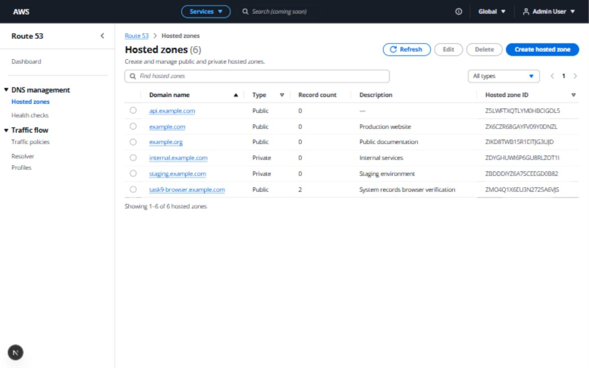
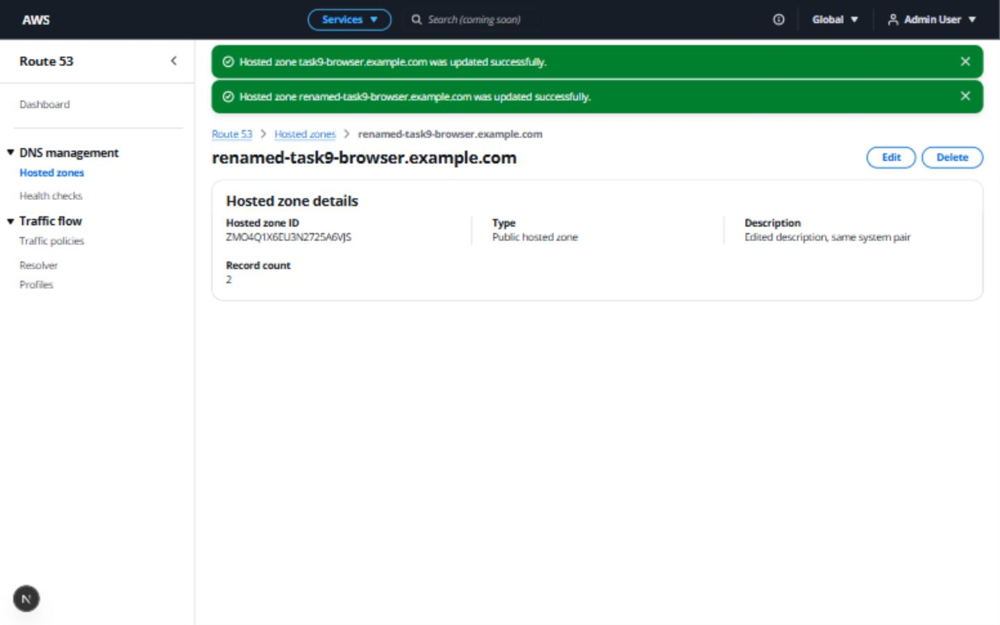
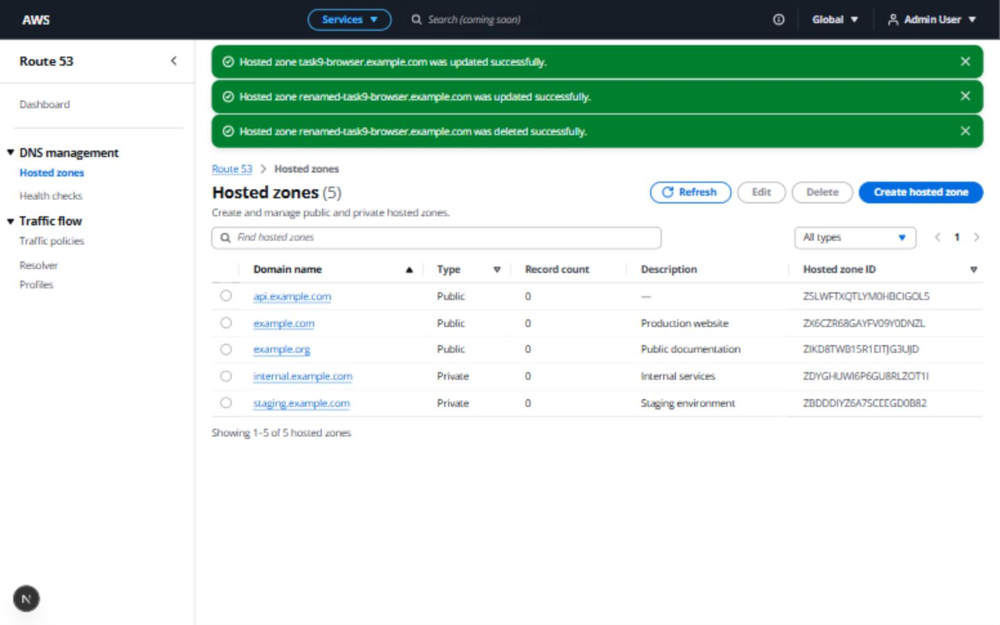

# Task 9 — Automatic NS/SOA system records

Verified on 2026-10-09 against the existing local frontend and FastAPI backend.

## Implementation

New PUBLIC and PRIVATE zones persist a HostedZone, one NS record set and one SOA
record in one commit. `system_record_service.py` owns generation and record-name
synchronization; `hosted_zone_service.py` owns commit/rollback. Existing UUID4
record IDs, enums, JSON values, flags, foreign keys and cascade behavior are reused.
No schema migration, frontend change, historical backfill or DNS record endpoint
was introduced. Swagger's existing create endpoint documents the mock defaults.

NS has four unique absolute mock nameserver values across com/net/org/co.uk,
TTL 172800, SIMPLE routing, alias false and is_system true. SOA has the first NS,
`awsdns-hostmaster.amazon.com.`, serial/timers `1 7200 900 1209600 86400`, TTL 900
and the same flags. Record owner names follow the zone's normalized apex without
a trailing dot. Constants live in one helper module. Values are inspired by
[Route 53 NS/SOA conventions](https://docs.aws.amazon.com/Route53/latest/DeveloperGuide/SOA-NSrecords.html)
and [AWS TTL guidance](https://aws.amazon.com/blogs/networking-and-content-delivery/dns-best-practices-for-amazon-route-53/).
They are mocked; there are no AWS calls or real DNS delegation.

Renames atomically change only system NS/SOA owner names, retaining IDs, values
and TTLs. Other updates never create another pair. Repeated factory calls reuse
a complete pair and reject inconsistent pairs. Existing count projections remain
unchanged: two persisted rows naturally produce record_count 2. Existing unloaded
database cascades remove records when their zone is deleted.

## Automated tests

`tests/test_system_records.py` adds 19 cases across these 15 test functions:

| Test | Coverage |
| --- | --- |
| persisted_system_pair_and_derived_counts | Public/private; fresh-session persistence, UUID4 IDs, normalized names, flags, enums, NS/SOA fields, create/detail/list counts and no count column |
| mock_nameservers_have_four_unique_absolute_dns_families | Four unique values, absolute DNS format, family and numeric ranges across 20 generated sets |
| factory_repeated_before_and_after_flush_does_not_duplicate | Repeated calls before flush and after reloading do not regenerate records |
| factory_rejects_inconsistent_existing_pair | Partial and duplicated system pairs rejected |
| duplicate_zone_names_have_separate_record_ids_and_values_lists | Same-name zones own distinct records and independent mutable values |
| updates_and_type_transitions_never_generate_more_records | Comment, VPC, region, public/private changes and equivalent normalized names preserve the pair |
| rename_only_updates_system_apex_names_and_preserves_dns_data | System owners follow the zone; IDs, values and TTLs retained; other records untouched |
| rename_failure_rolls_back_zone_and_system_names | Failures after record-name SQL and during commit restore both zone and records; session recovers |
| record_insert_failure_rolls_back_all_rows_and_session_recovers | Separate NS/SOA failures after rows reach SQLite leave no zone or records; subsequent creation succeeds |
| generation_failure_clears_pending_zone | Factory exception rolls back pending zone and leaves session reusable |
| successful_create_commits_once | Exactly one commit for zone and pair |
| delete_uses_database_cascade_for_unloaded_system_records | Actual database cascade removes both records without individual record deletes |
| other_owner_cannot_read_rename_or_delete_system_zone | Owner isolation preserved |
| historical_zones_unchanged_by_startup_and_updates | Startup, comment editing and rename do not backfill old zones |
| no_record_api_routes_added | OpenAPI has no record endpoints and documents mock create behavior |

`tests/test_hosted_zones.py` adds two public/private API cases checking count 2
across POST/GET/list and persisted system flags. Existing count and cascade
expectations now include the defaults. The ID collision retry test also verifies
that only the successful new zone receives records.

| Check | Result |
| --- | --- |
| Focused system record + hosted-zone tests, warnings as errors | 139 passed in 50.12s |
| Full `python -m pytest -W error -q` | 222 passed in 83.46s |
| `alembic upgrade head` | PASS |
| `alembic current` | `0001_core_tables (head)` |
| `alembic check` | No new upgrade operations detected |
| FastAPI startup /health /docs | PASS; HTTP 200 |
| Swagger/OpenAPI | Updated existing create docs; zero DNS record endpoints |
| Frontend `npm run lint` | PASS |
| Frontend `npm run typecheck` | PASS |
| Frontend `npm run build` | PASS |

## Live authenticated API verification

Created `example.com`, comment `NS SOA test`, PUBLIC via the existing cookie-authenticated
API. New ID: `Z0VRMR8N0M3KET6N136D4`. POST, detail GET and list all returned count 2.
SQLite held exactly one system NS row and one system SOA row with UUID4 IDs:

- NS `4a0285e0-6d31-43a9-b9e3-d2e537b30d99`: `ns-21.awsdns-10.com.`,
  `ns-765.awsdns-19.net.`, `ns-1360.awsdns-63.org.`, `ns-1691.awsdns-57.co.uk.`
- SOA `c56f0092-5d18-4cbf-ac49-cf49b623c726`:
  `ns-21.awsdns-10.com. awsdns-hostmaster.amazon.com. 1 7200 900 1209600 86400`

PATCH renamed the zone to `renamed-task9-api.example.com`. Direct SQLite reads
confirmed both owner names changed while IDs, values, TTLs, routing and flags
remained identical. DELETE returned successfully and related DNS row count became
zero. This temporary zone was removed.

## Browser verification

Used the existing signed-in frontend at 1440 × 900 without changing its source.

1. Created PUBLIC `task9-browser.example.com`, ID `ZMO4Q1X6EU3N2725A6VJS`.
2. Success Flashbar and detail showed count 2 from the backend.
3. Full browser reload preserved authentication and fetched count 2.
4. Returned to list: new zone displayed 2; the five older zones still displayed 0.
5. Opened its domain link and edited the description to `Edited description, same system pair`.
6. Save succeeded, detail reflected the comment and retained count 2.
7. Renamed to `renamed-task9-browser.example.com`; title/breadcrumb updated, ID unchanged, count still 2.
8. Delete opened the existing confirmation modal; confirming deleted the test zone,
   returned to the five-row list and displayed a success Flashbar.

Temporary viewport override was reset. Both API/browser test zones were removed.
The final SQLite rows match the original five-zone metadata/count baseline exactly,
with zero DNS records on those historical zones. All 60 baselined frontend and
Alembic source/config files have unchanged SHA256 hashes. Generated caches and
build outputs are excluded from source comparisons.

DNS Record CRUD API/UI, BIND operations and dashboard work remain unimplemented.
